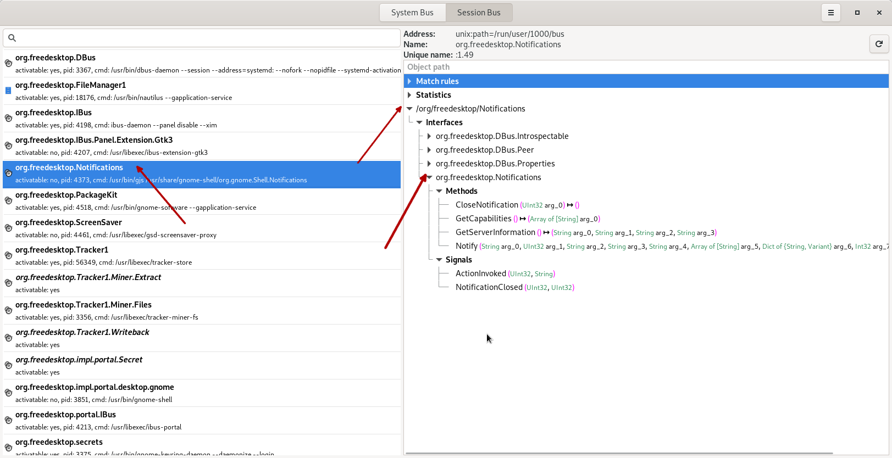

# X Window System

Unix-like systems that support a Graphical User Interface usually do this through the X Window System.
This system is implemented with a client-server model: the X Server is the component that controls the screen, keyboard, mouse, and other parts related to the GUI, while the X clients are the applications that want to use the graphical interface (like, for example, an internet browser).

The clients and the server communicate using a standardized protocol, and the system does not necessarily require the client and server to be on the same machine. Although not so common nowadays, the X client can run on a different machine than the server, with the communication happening over the network.
But in the more usual case, when both the client and the server are on the same machine, modern implementations of the X Window System use a faster communication channel, like a Unix socket.

## X client and server on the same machine

Let's investigate the case when both the X client and X server run on the same machine.
First we'll take a look at the Unix sockets that are in listening mode.

```Bash
student@os:~$ sudo netstat -xnlp | grep X11
unix  2      [ ACC ]     STREAM     LISTENING     29120    3472/Xorg            @/tmp/.X11-unix/X0
unix  2      [ ACC ]     STREAM     LISTENING     29121    3472/Xorg            /tmp/.X11-unix/X0
```

We observe the `Xorg` process (the X server) listening on a Unix socket with the path `/tmp/.X11-unix/X0`.

Now let's run an X client (that is, a GUI application) and check that it will indeed connect to this Unix socket. A very simple example is the `xeyes` application.

```Bash
student@os:~$ strace -e trace=socket,connect xeyes
socket(AF_UNIX, SOCK_STREAM|SOCK_CLOEXEC, 0) = 3
connect(3, {sa_family=AF_UNIX, sun_path=@"/tmp/.X11-unix/X0"}, 20) = 0
```

As expected, the application creates a Unix socket, then connects to the path `@"/tmp/.X11-unix/X0"`.

Furthermore, let's confirm that there is actual communication taking place between xeyes and the X server. We'll run xeyes again and then we'll keep moving the mouse cursor around. When the mouse is moved, the following events are taking place:

- The X server captures the mouse movements (since the server is the one that controls the mouse)
- The X server will pass these "mouse moved" events to the clients (including xeyes)
- The client (xeyes) uses these events to update their window (changing the position of the pupils inside the eyes)

So, if we run xeyes under strace, we expect to see some communication on the Unix socket that is created at the beginning.

```Bash
strace -e 'trace=!poll' -e trace='socket,connect,recvmsg' xeyes |& grep -v '\-1 EAGAIN
```


# D-Bus

D-Bus is an Inter-Process Communication (IPC) mechanism that is commonly present on Linux. It is particularly used by various components of the desktop environment (like GNOME) to communicate between one another, although the system itself is general-purpose and can be used in any other situations.

As the name suggests, the communication model is that of a bus: processes connect to the bus, then exchange messages with other processes through the bus. The bus itself is implemented by the dbus-daemon. There are in fact multiple buses: one system bus, accessible system-wide, and one or more session buses, each one corresponding to one user login session.

Every process that connects to D-Bus receives a unique connection name. This name can be something human-readable, like `org.freedesktop.Notifications`, or some generated id, like `:1.63`. Once a process is connected, it can expose one or multiple `objects`. An object has a path-like name, consisting of strings separated by a slash character (for example `/org/freedesktop/Notifications`). Each object contains one or more `interfaces`, which have the methods that can be called on that object.

## D-Bus inspection with d-feet

In order to better understand these concepts, we'll use a graphical tool (`d-feet`) to inspect all the available D-Bus objects on our system.

First install d-feet
```Bash
student@os:~$ sudo apt-get install d-feet
```

Run d-feet and select `Session Bus` from the top button.


On the left panel we can see all the processes connected to D-Bus with their associated `connection names`. Scroll and find `org.freedesktop.Notifications`. On the right side expand `/org/freedesktop/Notifications` and then expand the `org.freedesktop.Notifications` interface. The window should look like this:



Some observations:
* The bus communication happens over a Unix socket, with the path `/run/user/1000/bus`.
* `org.freedesktop.Notifications` on the left panel is the `connection name`.
* The process that has connected with this name is `/usr/bin/gjs /usr/share/gnome-shell/org.gnome.Shell.Notifications` and has the pid of `4373`.
* This process exposes one object: `/org/freedesktop/Notifications`. Note that the object name is the same as the connection name, where the dots have been replaced with slashes. This is not a requirement, as the objects exposed by a process can have any name.
* The object has 4 interfaces: `org.freedesktop.DBus.Introspectable`, `org.freedesktop.DBus.Peer`, `org.freedesktop.DBus.Properties` and `org.freedesktop.Notifications`. Note that the last one (`org.freedesktop.Notifications`) is the same as the connection name, but this is just a coincidence, not a requirement.
* The interface `org.freedesktop.Notifications` has some methods that can be called, such as `Notify`.

## Calling D-Bus methods

The application behind `org.freedesktop.Notifications` is responsible with desktop notifications (the small bubbles of text that appear at the top of the screen when some event happens). When an application wants to send a notification it needs to connect to D-Bus and call the `Notify` method from the `org.freedesktop.Notifications` interface.

In this example we want to call the `Notify` method ourselves. To do this, we must first understand the signature of this method:

`Notify (String arg_0, UInt32 arg_1, String arg_2, String arg_3, String arg_4, Array of [String] arg_5, Dict of {String, Variant} arg_6, Int32 arg_7) ↦ (UInt32 arg_8)`

This doesn't tell us much, but we can find more documentation [here](https://specifications.freedesktop.org/notification-spec/notification-spec-latest.html#basic-design), since `freedesktop` is an open standard.

We'll set the arguments to the following (for our simple case most of them will be unused):
* `app_name`: `""`
* `replaces_id`: `0`
* `app_icon`: `""`
* `summary`: `"This is the title"`
* `body`: `"This is the content"`
* `actions`: `[]`
* `hints`: `{}`
* `expire_timeout`: `-1`

Now the question is how to actually call the method. Normally we would have to write an application that connects to D-Bus and does the call. But for demonstrative purposes there are easier ways.

One way is directly from d-feet. If we double-click on the `Notify` method in the right-side pane of d-feet, a window will open that allows us to call the method with any arguments that we want.


Then we click the `Execute` button and the notification will appear.


Another way is from the command line. There's the tool `gdbus` that can do this.

```Bash
student@os:~$ gdbus call \
      --session \
      --dest org.freedesktop.Notifications \
      --object-path /org/freedesktop/Notifications \
      --method org.freedesktop.Notifications.Notify \
      -- \
      '""' \
      0 \
      '""' \
      "This is the title" \
      "This is the content" \
      [] \
      {} \
      -1
```

Let's see how it works:


## Inspecting the low-level communication

Let's run gdbus under `strace` to see what's happening behind the scenes

```Bash
student@os:~$ strace -s 1000 -f -e trace=socket,connect,sendmsg,recvmsg gdbus call \
      --session \
      --dest org.freedesktop.Notifications \
      --object-path /org/freedesktop/Notifications \
      --method org.freedesktop.Notifications.Notify \
      -- \
      '""' \
      0 \
      '""' \
      "This is the title" \
      "This is the content" \
      [] \
      {} \
      -1
```

```Bash
strace: Process 61888 attached
[pid 61887] socket(AF_UNIX, SOCK_STREAM|SOCK_CLOEXEC, 0) = 5
[pid 61887] connect(5, {sa_family=AF_UNIX, sun_path="/run/user/1000/bus"}, 110) = 0
[pid 61887] sendmsg(5, {msg_name=NULL, msg_namelen=0, msg_iov=[{iov_base="\0", iov_len=1}], msg_iovlen=1,
msg_control=[{cmsg_len=28, cmsg_level=SOL_SOCKET, cmsg_type=SCM_CREDENTIALS, cmsg_data={pid=61887,
uid=1000, gid=1000}}],
msg_controllen=32, msg_flags=0}, MSG_NOSIGNAL) = 1
strace: Process 61889 attached
[pid 61889] sendmsg(5, {msg_name=NULL, msg_namelen=0, msg_iov=[{iov_base="l\1\0\1\0\0\0\0\1\0\0\0n\0\0\0
\1\1o\0\25\0\0\0/org/freedesktop/DBus\0\0\0\2\1s\0\24\0\0\0org.freedesktop.DBus\0\0\0\0\6\1s\0\24\0\0\0
org.freedesktop.DBus\0\0\0\0\3\1s\0\5\0\0\0Hello\0\0\0", iov_len=128}], msg_iovlen=1, msg_controllen=0,
msg_flags=0}, MSG_NOSIGNAL) = 128
[pid 61889] recvmsg(5, {msg_name=NULL, msg_namelen=0, msg_iov=[{iov_base="l\2\1\1\v\0\0\0\1\0\0\0=\0\0\0",
iov_len=16}], msg_iovlen=1, msg_controllen=0, msg_flags=MSG_CMSG_CLOEXEC}, MSG_CMSG_CLOEXEC) = 16
[pid 61889] recvmsg(5, {msg_name=NULL, msg_namelen=0, msg_iov=[{iov_base="\6\1s\0\6\0\0\0:1.497\0\0\5\1u
\0\1\0\0\0\10\1g\0\1s\0\0\7\1s\0\24\0\0\0org.freedesktop.DBus\0\0\0\0\6\0\0\0:1.497\0", iov_len=75}],
msg_iovlen=1, msg_controllen=0, msg_flags=MSG_CMSG_CLOEXEC}, MSG_CMSG_CLOEXEC) = 75
[pid 61889] recvmsg(5, {msg_name=NULL, msg_namelen=0, msg_iov=[{iov_base="l\4\1\1\v\0\0\0\2\0\0\0\215\0\0\0",
iov_len=16}], msg_iovlen=1, msg_controllen=0, msg_flags=MSG_CMSG_CLOEXEC}, MSG_CMSG_CLOEXEC) = 16
[pid 61889] recvmsg(5, {msg_name=NULL, msg_namelen=0, msg_iov=[{iov_base="\1\1o\0\25\0\0\0/org/freedesktop/DBus
\0\0\0\2\1s\0\24\0\0\0org.freedesktop.DBus\0\0\0\0\3\1s\0\f\0\0\0NameAcquired\0\0\0\0\6\1s\0\6\0\0\0:1.497\0\0
\10\1g\0\1s\0\0\7\1s\0\24\0\0\0org.freedesktop.DBus\0\0\0\0\6\0\0\0:1.497\0", iov_len=155}], msg_iovlen=1,
msg_controllen=0, msg_flags=MSG_CMSG_CLOEXEC}, MSG_CMSG_CLOEXEC) = 155
[pid 61889] sendmsg(5, {msg_name=NULL, msg_namelen=0, msg_iov=[{iov_base="l\1\0\1\0\0\0\0\2\0\0\0\223\0\0\0\1\1
o\0\36\0\0\0/org/freedesktop/Notifications\0\0\2\1s\0#\0\0\0org.freedesktop.DBus.Introspectable\0\0\0\0\0\6\1s\0
\35\0\0\0org.freedesktop.Notifications\0\0\0\3\1s\0\n\0\0\0Introspect\0\0\0\0\0\0", iov_len=168}], msg_iovlen=1,
msg_controllen=0, msg_flags=0}, MSG_NOSIGNAL) = 168
[pid 61889] recvmsg(5, {msg_name=NULL, msg_namelen=0, msg_iov=[{iov_base="l\2\1\1Z\v\0\0\307\0\0\0.\0\0\0",
iov_len=16}], msg_iovlen=1, msg_controllen=0, msg_flags=MSG_CMSG_CLOEXEC}, MSG_CMSG_CLOEXEC) = 16
[pid 61889] recvmsg(5, {msg_name=NULL, msg_namelen=0, msg_iov=[{iov_base="\6\1s\0\6\0\0\0:1.497\0\0\10\1g\0\1s\0
\0\5\1u\0\2\0\0\0\7\1s\0\5\0\0\0:1.49\0\0\0U\v\0\0<!DOCTYPE node PUBLIC \"-//freedesktop//DTD D-BUS Object 
Introspection 1.0//EN\"\n                      \"http://www.freedesktop.org/standards/dbus/1.0/introspect.dtd\">\n
<!-- GDBus 2.66.8 -->\n<node>\n  <interface name=\"org.freedesktop.DBus.Properties\">\n    <method name=\"Get\">\n      
<arg type=\"s\" name=\"interface_name\" direction=\"in\"/>\n      <arg type=\"s\" name=\"property_name\" 
direction=\"in\"/>\n      <arg type=\"v\" name=\"value\" direction=\"out\"/>\n    </method>\n    <method name=\"GetAll\">\n
      <arg type=\"s\" name=\"interface_name\" direction=\"in\"/>\n      <arg type=\"a{sv}\" name=\"properties\" direction=
\"out\"/>\n    </method>\n    <method name=\"Set\">\n      <arg type=\"s\" name=\"interface_name\" direction=\"in\"/>\n      
<arg type=\"s\" name=\"property_name\" direction=\"in\"/>\n      <arg type=\"v\" name=\"value\" direction=\"in\"/>\n    
</method>\n    <signal name=\"PropertiesChanged\">\n      <arg type=\"s\" name=\"interface_name\"/>\n      
<arg type=\"a{sv}\" name=\"changed_properties"..., iov_len=2954}], msg_iovlen=1, msg_controllen=0, msg_flags=MSG_CMSG_CLOEXEC},
MSG_CMSG_CLOEXEC) = 2954
[pid 61889] sendmsg(5, {msg_name=NULL, msg_namelen=0, msg_iov=[{iov_base="l\1\0\1T\0\0\0\3\0\0\0\237\0\0\0\1
\1o\0\36\0\0\0/org/freedesktop/Notifications\0\0\2\1s\0\35\0\0\0org.freedesktop.Notifications\0\0\0\6\1s\0\35
\0\0\0org.freedesktop.Notifications\0\0\0\10\1g\0\rsusssasa{sv}i\0\0\0\0\0\0\3\1s\0\6\0\0\0Notify\0\0\0\0\0\0
\0\0\0\0\0\0\0\0\0\0\0\0\0\0\0\0\21\0\0\0This is the title\0\0\0\23\0\0\0This is the content\0\0\0\0\0\0\0\0\0
\0\0\0\0\377\377\377\377", iov_len=260}], msg_iovlen=1, msg_controllen=0,
 msg_flags=0}, MSG_NOSIGNAL) = 260
[pid 61889] recvmsg(5, {msg_name=NULL, msg_namelen=0, msg_iov=[{iov_base="l\2\1\1\4\0\0\0\312\0\0\0.\0\0\0", iov_len=16}],
msg_iovlen=1, msg_controllen=0, msg_flags=MSG_CMSG_CLOEXEC}, MSG_CMSG_CLOEXEC) = 16
[pid 61889] recvmsg(5, {msg_name=NULL, msg_namelen=0, msg_iov=[{iov_base="\6\1s\0\6\0\0\0:1.497\0\0\10\1g\0\1u\0\0\5\1u\0
\3\0\0\0\7\1s\0\5\0\0\0:1.49\0\0\0\36\0\0\0", iov_len=52}], msg_iovlen=1, msg_controllen=0, msg_flags=MSG_CMSG_CLOEXEC}, MSG_CMSG_CLOEXEC) = 52
(uint32 30,)
[pid 61889] +++ exited with 0 +++
[pid 61888] +++ exited with 0 +++
+++ exited with 0 +++
```

We see a Unix socket being created and a connection made to `/run/user/1000/bus`, as expected. Then a series of messages are exchanged on the socket, which are part of the D-Bus protocol. On a closer look, we can even identify some strings from our notification, like `This is the title` or `This is the content`.

```Bash
[pid 61889] sendmsg(5, {msg_name=NULL, msg_namelen=0, msg_iov=[{iov_base="l\1\0\1T\0\0\0\3\0\0\0\237\0\0\0\1
\1o\0\36\0\0\0/org/freedesktop/Notifications\0\0\2\1s\0\35\0\0\0org.freedesktop.Notifications\0\0\0\6\1s\0\35
\0\0\0org.freedesktop.Notifications\0\0\0\10\1g\0\rsusssasa{sv}i\0\0\0\0\0\0\3\1s\0\6\0\0\0Notify\0\0\0\0\0\0
\0\0\0\0\0\0\0\0\0\0\0\0\0\0\0\0\21\0\0\0This is the title\0\0\0\23\0\0\0This is the content\0\0\0\0\0\0\0\0\0
\0\0\0\0\377\377\377\377", iov_len=260}], msg_iovlen=1, msg_controllen=0,
```

## Firefox

Install Firefox if not already present:
```Bash
student@os:~$ sudo apt-get install firefox
```

Then let's do the following experiment:
- Open the Firefox browser
- From a terminal run `firefox www.google.com`


Notice that the url that we passed in the command line was opened in the existing Firefox window as a new tab. Even though we started a separate Firefox process, which should have created a separate new window, this did not happen. Instead, the process that we started from the command line exited immediately and the site was opened in the already running Firefox instance.

Without any precise knowledge about Firefox internals, we can guess that something like this happened:
- The newly started Firefox process detected that another instance of Firefox is already running
- The newly started Firefox process sent a message to the existing running process, requesting it to open an url in a new tab

Since we're talking about message passing between 2 processes, there's a chance that maybe D-Bus was involved. Let's check: we'll use a tool called `dbus-monitor` that will print all messsages passed through D-Bus.

```Bash
student@os:~$ dbus-monitor
```

Then, in another terminal, we'll run again `firefox www.google.com`.

Going back to the `dbus-monitor` output we'll find the following:
```Bash
...
method call time=1655809062.813923 sender=:1.757 -> destination=org.mozilla.firefox.ZGVmYXVsdC1yZWxlYXNl serial=2 path=/org/mozilla/firefox/Remote; interface=org.mozilla.firefox; member=OpenURL
   array of bytes [
      02 00 00 00 1a 00 00 00 2f 00 00 00 2f 68 6f 6d 65 2f 61 64 72 69 61 6e
      73 00 2f 6f 70 74 2f 66 69 72 65 66 6f 78 2f 66 69 72 65 66 6f 78 00 77
      77 77 2e 67 6f 6f 67 6c 65 2e 63 6f 6d 00
   ]
```

There was a D-Bus call to `org.mozilla.firefox.ZGVmYXVsdC1yZWxlYXNl`, on the object `/org/mozilla/firefox/Remote`, method `OpenURL` from the `org.mozilla.firefox` interface. Indeed, we see that this object exists in d-feet as well:


We can try to call the `OpenURL` method ourselves, directly from d-feet. The method has only one argument of the type `Array of [Byte]`. Although there's no documentation for it, we can use the same byte array that we saw in `dbus-monitor`:

```
   array of bytes [
      02 00 00 00 1a 00 00 00 2f 00 00 00 2f 68 6f 6d 65 2f 61 64 72 69 61 6e
      73 00 2f 6f 70 74 2f 66 69 72 65 66 6f 78 2f 66 69 72 65 66 6f 78 00 77
      77 77 2e 67 6f 6f 67 6c 65 2e 63 6f 6d 00
   ]
```

(Note that `77 77 77 2e 67 6f 6f 67 6c 65 2e 63 6f 6d` at the end is the string `www.google.com`, so that's another confirmation that we're on the right track).


