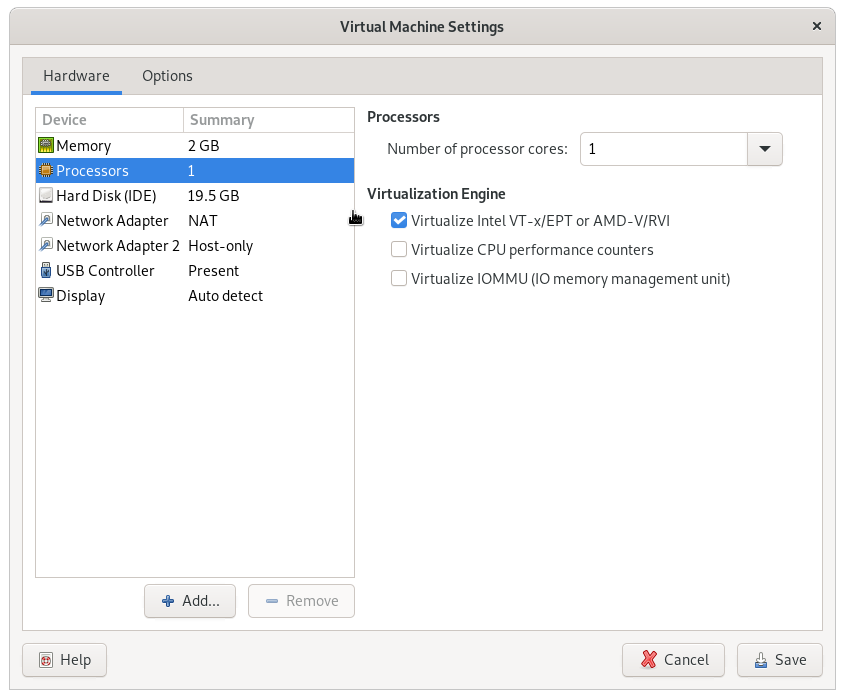

# OS Cloud

In this section we are going to build a "toy cloud" called `OS Cloud`.
Similar to a real cloud (like `aws`), `OS Cloud` will allow us to create and manage virtual machines, through an `http` API.

## Containers

Our app will make use of `docker` containers.
A container is an OS-level virtualization method in which a group of userspace processes are isolated from the rest of the system.

Take for example a database server.
Instead of running it directly on the host system, we'll run it in its own container.
This way the server process will be isolated from other processes on the system.
It will also have its own filesystem.

Besides isolation, containers are also useful for portability.
Since a container comes with its own filesystem image, we can pack it together will all the dependencies, so that the app will run correctly no matter what packages are installed on the host system.

Finally, since our application will consist of more than 1 container, we'll also use `docker-compose`, which is a tool that helps us with running multi-container applications

## Prerequisites

Make sure the following packages are installed:

```console
sudo apt-get -y update; sudo apt-get -y install docker-compose jq
```

Also, make sure your user can run docker commands.
If not, maybe you need to add it to the `docker` group:

```console
sudo usermod -aG docker student
```

Then, after relogin:

```console
student@os:~$ docker ps
CONTAINER ID   IMAGE     COMMAND   CREATED   STATUS    PORTS     NAMES
```

If you are running inside a virtual machine, you need to enable nested virtualization.
Example for vmware:



For virtualbox:


If the button is greyed out, try from the command line:

```console
student@os:~$ VBoxManage  list vms
"USO 2022-2023" {042a5725-bfb7-4a46-9743-1164d3acac23}

student@os:~$ VBoxManage modifyvm {042a5725-bfb7-4a46-9743-1164d3acac23} --nested-hw-virt on
```

## Initial Liftoff

First, we need to do some initial setup:

```console
student@os:~/.../support/os-cloud$ ./initial_setup.sh
```

Then go to `support/os-cloud` and run:

```console
student@os:~/.../support/os-cloud$ ./setup_db.sh
Setting up db
Starting db server
Waiting for db server to start
...
Stopping db server
Restarting db server
Waiting for db server to start
Creating tables
Stopping db server

student@os:~/.../support/os-cloud$ docker-compose up --build
```

Now the http API will listen on port `localhost:5000`. Let's try:

```console
student@os:~/.../support/os-cloud$ curl localhost:5000
Welcome to OS Cloud!
```

Let's check the running virtual machines:

```console
student@os:~/.../support/os-cloud$ curl localhost:5000/vm_list
[]
```

We got an empty list, since there are no virtual machines yet.
Let's create one (the command will take about 1 minute to complete):

```console
student@os:~/.../support/os-cloud$ curl -H "Content-Type: application/json" \
	-d '{ "name": "my_vm", "image": "ubuntu_22.04", "network": "default", "mem_size": "2G", "disk_size": "10G"}' \
	localhost:5000/vm_create
{"id":1,"status":"ok"}
```

Check the virtual machine list again:

```console
student@os:~/.../support/os-cloud$ curl localhost:5000/vm_list
[{"id":1,"name":"my_vm"}]
```

We can also use the `jq` tool to pretty print the `json` outputs:

```console
student@os:~/.../support/os-cloud$ curl -s localhost:5000/vm_list | jq .
[
  {
    "id": 1,
    "name": "my_vm"
  }
]
```

We see our newly created virtual machine.
Let's get some information about it:

```console
student@os:~/.../support/os-cloud$ curl -s -H "Content-Type: application/json" -d '{ "id": 1 }' localhost:5000/vm_info | jq .
{
  "disk_size": 10737418240,
  "id": 1,
  "ip": "192.168.0.2",
  "mem_size": 2147483648,
  "name": "my_vm",
  "network": "default",
  "os": "ubuntu_22.04",
  "state": "RUNNING"
}
```

We recognize some parameters that we specified at creation time, like `mem_size` and `disk_size`.
Also, the IP address `192.168.0.2` has been allocated for our machine.

## More Implementation Details

The application consists of 2 containers:

- `db`, which runs a `MySQL` database

- `os-cloud`, which runs the web application and the virtual machines

Let's check them.
After running `docker-compose up`, in another terminal run `docker-compose ps`:

```console
student@os:~/.../support/os-cloud$ docker-compose ps
       Name                      Command              State                    Ports
------------------------------------------------------------------------------------------------------
os-cloud_db_1         docker-entrypoint.sh mariadbd   Up      3306/tcp
os-cloud_os-cloud_1   python3 -u app.py               Up      0.0.0.0:5000->5000/tcp,:::5000->5000/tcp

```

Now let's move inside the `os-cloud` container:

```console
student@os:~/.../support/os-cloud$ docker-compose exec os-cloud bash
root@89a986d2526e:/app#
```

Since the virtual machines run inside this container, we should expect to see the one that we created in the previous step.

```console
root@89a986d2526e:/app# ps -ef | cat
UID          PID    PPID  C STIME TTY          TIME CMD
root           1       0  0 09:02 ?        00:00:00 /sbin/docker-init -- python3 -u app.py
root           7       1  0 09:02 ?        00:00:00 python3 -u app.py
root          12       7  6 09:02 ?        00:00:41 qemu-system-x86_64 -enable-kvm -m 2048 -hda /vm-disks/1/disk.qcow2 -net nic,macaddr=52:54:00:12:34:00 -net tap,ifname=tap0,script=no -monitor telnet::10001,server,nowait -serial telnet::10002,server,nowait -nographic
root          27       0  0 09:11 pts/3    00:00:00 bash
root          35      27  0 09:13 pts/3    00:00:00 ps -ef
```

Indeed, a `qemu-system-x86_64` process is there.
The vm should be accessible via `ssh` on the IP `192.168.0.2` with password `123456` (if you get `connection refused` here you need to wait a bit more for the machine to boot):

```console
root@adf6e0bf4e6e:/app# ssh root@192.168.0.2
The authenticity of host '192.168.0.2 (192.168.0.2)' can't be established.
ED25519 key fingerprint is SHA256:3Mfa1fB9y4knUDJWEmEOTz9dWOE7SVhnH/kCBJ15Y0E.
This key is not known by any other names
Are you sure you want to continue connecting (yes/no/[fingerprint])? yes
Warning: Permanently added '192.168.0.2' (ED25519) to the list of known hosts.
root@192.168.0.2's password:
Welcome to Ubuntu 22.04 LTS (GNU/Linux 5.15.0-40-generic x86_64)

...

Last login: Thu Nov 17 07:49:55 2022
root@ubuntu:~#
```

The vm is also accessible on the serial console (notice the `-serial telnet::10002,server,nowait` argument to qemu).
If we start a telnet connection on port `10002`, qemu will show us the virtual machine's serial console (basically the output that we normally see when running a virtual machine in text mode)

```console
root@adf6e0bf4e6e:/app# telnet localhost 10002
Trying 127.0.0.1...
Connected to localhost.
Escape character is '^]'.

ubuntu login: root
Password:
Welcome to Ubuntu 22.04 LTS (GNU/Linux 5.15.0-40-generic x86_64)

...

Last login: Thu Nov 17 07:50:11 UTC 2022 from 192.168.0.1 on pts/0
root@ubuntu:~#
```

To exit the serial console press `CTRL+]`, then type `quit`:

```console
root@ubuntu:~#
telnet> quit
Connection closed.
root@adf6e0bf4e6e:/app#
```

## (Even) More Implementation Details

The architecture of the system can be summarized in the following diagram:


The `os-cloud` container is the core of the entire system.
It consists of a web application written in python using `flask`.
This web application exposes a virtual machine `API` that the user can interact with (like `vm_create`).

So, when we're calling `curl` like in the example above:

```console
curl -H "Content-Type: application/json" \
	-d '{ "name": "my_vm", "image": "ubuntu_22.04", "network": "default", "mem_size": "2G", "disk_size": "10G"}' \
	localhost:5000/vm_create
```

it will do an `HTTP POST` request (because of the `-d` parameter) to `/vm_create`.
The request will be handled by the `api_vm_create` function in `app.py` (because of the `@app.route("/vm_create", methods=["POST"])` line).

Inside this function, we also have access to the request payload (the string that comes after `-d` in our `curl` call).
More specifically, `request.json` will parse this payload as a `JSON` object and hand it back to us as a python dictionary.
In this dictionary we'll find the parameters for our request, like `name`, `image`, `network`, and so on.

The function will then take the actions required to create the virtual machine: create the disk, start qemu, interact with the database, etc.
Finally, whatever is returned by the `api_vm_create` function will be received by the `curl` request as the `HTTP` response.
Here we also return `JSON` objects, like `{"id":1,"status":"ok"}`.

There are 3 objects used by the system:

- `vm` - the actual virtual machine

- `disk` - holds information about virtual machine disks

- `network` - holds information about a network

Each of these objects are stored in a table in the database.

Let's check the database contents (take the password from the `setup_db.sh` file):

```console
student@os:~/.../support/os-cloud$ docker-compose exec db mysql -u os-cloud -p os-cloud
Enter password:
...
MariaDB [os-cloud]> select * from vm;
+----+-------+---------+------------+------------+-------------------+------------+----------+-------------------+------------------+-------+
| id | name  | disk_id | mem_size   | network_id | tap_interface_idx | ip         | qemu_pid | qemu_monitor_port | qemu_serial_port | state |
+----+-------+---------+------------+------------+-------------------+------------+----------+-------------------+------------------+-------+
|  1 | my_vm |       1 | 2147483648 |          1 |                 0 | 3232235522 |       18 |             10001 |            10002 |     0 |
+----+-------+---------+------------+------------+-------------------+------------+----------+-------------------+------------------+-------+
1 row in set (0.001 sec)

MariaDB [os-cloud]> select * from disk;
+----+-------------+---------------+
| id | size        | template_name |
+----+-------------+---------------+
|  1 | 10737418240 | ubuntu_22.04  |
+----+-------------+---------------+
1 row in set (0.000 sec)

MariaDB [os-cloud]> select * from network;
+----+---------+----------------------+------------+------------+
| id | name    | bridge_interface_idx | ip         | mask       |
+----+---------+----------------------+------------+------------+
|  1 | default |                    0 | 3232235520 | 4294901760 |
+----+---------+----------------------+------------+------------+
1 row in set (0.000 sec)
```

`Note: in real life DON'T store passwords in text files inside a repository`.

Some observations:

- There is a `default` network already created.
That is why we specified `"network": "default"` in the vm creation parameters, and we see that the vm is assigned to this network (`network_id` is `1`).

- This network's ip address is `3232235520`, which in hex is `0xC0A80000`, that is, `192.168.0.0`.
The netmask is `0xFFFF0000`, or `/16`.
This explains why our vm received the ip address `192.168.0.2`.

- There is a disk with the size of `10GB`, based on the `ubuntu_22.04` template, exactly like we requested.
This disk is assigned to our vm (`disk_id` is `1`).
The disk file will reside in `support/os-cloud/vm-disks/1/disk.qcow2`, or `/vm-disks/1/disk.qcow2` inside the container.

## Virtual Machine Creation

Take a look at the `vm_create` function in `support/os-cloud/os-cloud/vm.py`.
The steps undertaken are roughly:

1. some initial allocations: the virtual machine IP address, network interface, qemu ports, etc

1. the virtual machine disk is created, based on the template specified by the user (like `ubuntu_22.04`)

1. the virtual machine is started with this new disk, in order to do some more customizations (the `ubuntu_22_04_vm_prepare` function)

1. the virtual machine is restarted again with the final disk in place

## Disk Creation

All the disk templates are in `support/os-cloud/disk-templates`.
This directory will be mounted in `/disk-templates` inside the container.

The first step of disk creation is to create a `qcow2` disk file based on the template specified by the user (step 2 from the explanation above).

This is done in the `create_disk_from_template` function in `support/os-cloud/os-cloud/disk.py`.
The function will first create a disk object in the database, then it will call 2 shell scripts: `create_disk_from_template.sh` and `setup_root_password.sh`.

The second step is to start the virtual machine with this disk and do some customizations (step 3 from above).

This is done in the `ubuntu_22_04_vm_prepare` function in `support/os-cloud/os-cloud/vm.py`.
The code will connect to the vm's qemu serial console using `pexpect`.
Then it will use a series of `expect_exact` + `sendline` pairs to interact with the virtual machine, as if those commands were typed in the command-line.

## Practice: Create a New Disk by Hand

Let's replicate the above mentioned steps and create a new disk ourselves.

First, we have to call the 2 scripts from the `create_disk_from_template` function:

```console
student@os:~/.../support/os-cloud$ ./disk-templates/ubuntu_22.04/create_disk_from_template.sh ./disk-templates/ubuntu_22.04/ubuntu_22.04.qcow2 my-disk.qcow2 10737418240
Image resized.

student@os:~/.../support/os-cloud$ ls -lh my-disk.qcow2
-rw-r--r-- 1 student student 619M Nov 20 15:41 my-disk.qcow2

student@os:~/.../support/os-cloud$ sudo ./disk-templates/ubuntu_22.04/setup_root_password.sh my-disk.qcow2 123456
```

Now we can start a qemu instance using this disk:

```console
student@os:~/.../support/os-cloud$ qemu-system-x86_64 -enable-kvm -m 2G -hda my-disk.qcow2 -nographic
...
Ubuntu 22.04 LTS ubuntu ttyS0

ubuntu login: root
Password:
...
root@ubuntu:~#
```

Here we can further run customization commands, like the ones in the `ubuntu_22_04_vm_prepare` function, or any other things that we want.

When we're done, we run the `halt` command:

```console
root@ubuntu:~# halt
root@ubuntu:~#          Stopping Session 1 of User root...
[  OK  ] Removed slice Slice /system/modprobe.
[  OK  ] Stopped target Graphical Interface.
...
         Starting System Halt...
[   86.431398] reboot: System halted
```

When the `System halted` message is printed, press `CTRL+A X` to exit qemu (that is, press `CTRL+A`, release `CTRL` and `A`, press `X`).

## Practice: Implement `vm_stop`

The `vm_stop` command will stop a particular virtual machine, meaning it will stop the qemu process for that vm.
The implementation starts in `api_vm_stop` in `app.py`, which is the function that handles the `http` request for the stop operation.
Here you need to do the following:

- extract the virtual machine `id` from the request

- use the `vm.vm_get` function to convert this ID into a `VM` structure

- call `vm.vm_stop` and pass the `VM` object to it

In `vm.vm_stop`:

- call `stop_qemu_for_vm`

- change the vm pid in the database to `-1`

- change the vm state in the database to `VM_STATE_STOPPED`

After modifying the code you should run `docker-compose up --build` again.
Also, if your database became inconsistent, you can clean it up by re-running the `setup_db.sh` script.
Then delete all vm disks with `sudo rm -rf vm-disks/*`.

With `vm_stop` implemented, the system should work like this:

```console
student@os:~/.../support/os-cloud$ curl -s localhost:5000/vm_list | jq .
[
  {
    "id": 1,
    "name": "my_vm"
  }
]
student@os:~/.../support/os-cloud$ curl -H "Content-Type: application/json" -d '{ "id": 1}' localhost:5000/vm_scurl -s -H "Content-Type: application/json" -d '{ "id": 1 }' localhost:5000/vm_info | jq .
{
  "disk_size": 10737418240,
  "id": 1,
  "ip": "192.168.0.2",
  "mem_size": 2147483648,
  "name": "my_vm",
  "network": "default",
  "os": "ubuntu_22.04",
  "state": "RUNNING"
}
```

The vm is in the `RUNNING` state.
Now let's stop it:

```console
student@os:~/.../support/os-cloud$ curl -H "Content-Type: application/json" -d '{ "id": 1}' localhost:5000/vm_stop
{"status":"ok"}
student@os:~/.../support/os-cloud$ curl -s -H "Content-Type: application/json" -d '{ "id": 1 }' localhost:5000/vm_info | jq .
{
  "disk_size": 10737418240,
  "id": 1,
  "ip": "192.168.0.2",
  "mem_size": 2147483648,
  "name": "my_vm",
  "network": "default",
  "os": "ubuntu_22.04",
  "state": "STOPPED"
}
```

Now the state is `STOPPED`.
Inside the container, the qemu process should be gone as well:

```console
student@os:~/.../support/os-cloud$ docker-compose exec os-cloud bash
root@b0600eff8903:/app# ps -ef
UID          PID    PPID  C STIME TTY          TIME CMD
root           1       0  0 10:00 ?        00:00:00 /sbin/docker-init -- python3 -u app.py
root           7       1  0 10:00 ?        00:00:00 python3 -u app.py
root          33       0  0 10:00 pts/3    00:00:00 bash
root          41      33  0 10:00 pts/3    00:00:00 ps -ef
```

Finally, the vm can be started again using `vm_start`:

```console
student@os:~/.../support/os-cloud$ curl -H "Content-Type: application/json" -d '{ "id": 1}' localhost:5000/vm_start
{"status":"ok"}
```
