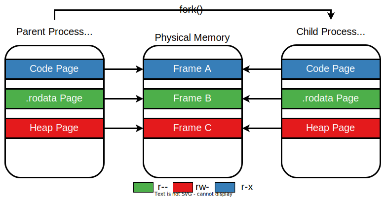
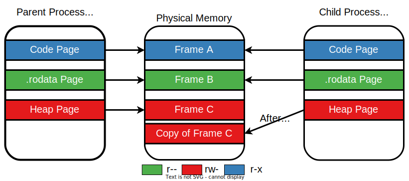

# Copy-on-Write

So far, you know that the parent and child process have separate virtual address spaces.
But how are they created, namely how are they "separated"?
And what about the **PAS (physical address space)**?
Of course, we would like the stack of the parent, for example, to be physically distinct from that of the child, so they can execute different functions and use different local variables.

But should **all** memory sections from the PAS of the parent be distinct from that of the child?
What about some read-only memory sections, such as `.text` and `.rodata`?
And what about the heap, where the child _may_ use some data previously written by the parent and then override it with its own data.

The answer to all of these questions is a core mechanism of multiprocess operating systems called **Copy-on-Write**.
It works according to one very simple principle:
> The VAS of the child process initially points to the same PAS as that of the parent.
> A (physical) frame is only duplicated by the child when it attempts to **write** data to it.

This ensures that read-only sections remain shared, while writable sections are shared as long as their contents remain unchanged.
When changes happen, the process making the change receives a unique frame as a modified copy of the original frame _on demand_.

In the image below, we have the state of the child and parent processes right after `fork()` returns in both of them.
See how each has its own VAS, both of them being mapped to (mostly) the same PAS.



When one process writes data to a writeable page (in our case, the child writes to a heap page), the frame to which it corresponds is first duplicated.
Then the process' page table points the page to the newly copied frame, as you can see in the image below.



**Be careful!**
Do not confuse **copy-on-write** with **demand paging**.
Remember from the [Data chapter](../../../data/) that **demand paging** means that when you allocate memory, the OS allocates virtual memory that remains unmapped to physical memory until it's used.
On the other hand, **copy-on-write** posits that the virtual memory is already mapped to some frames.
These frames are only duplicated when one of the processes attempts to write data to them.

## Practice

Now let's see the copy-on-write mechanism in practice.
Keep in mind that `fork()` is a function used to create a process.

Open two terminals (or better: use [`tmux`](https://github.com/tmux/tmux/wiki)).
In one of them, compile and run the code in `support/fork-faults/fork_faults.c`.
After each time you press `Enter` in the first terminal window, run the following command in the second window:

```console
student@os:~/.../lab/support/fork-faults$ ps -o min_flt,maj_flt -p $(pidof fork_faults)
```

It will show you the number of minor and major page faults performed by the `fork_faults` process and its child.

To better understand minor and major page faults, go through the [Minor and Major Page Faults](arena.md#minor-and-major-page-faults) excercise in Arena.

[Quiz 1](../quiz/parent-faults-before-fork.md)

Note that after `fork()`-ing, there is a second row in the output of `ps`.
That corresponds to the child process.
The first one still corresponds to the parent.

[Quiz 2](../quiz/child-faults-after-write.md)

Now it should be clear how demand paging differs from copy-on-write.
Shared memory is a similar concept.
It's a way of marking certain allocated pages so that copy-on-write is disabled.
As you may imagine, changes made by the parent to this memory are visible to the child and vice-versa.
You can learn more about it in [its dedicated section in the Arena](./arena.md#shared-memory).
