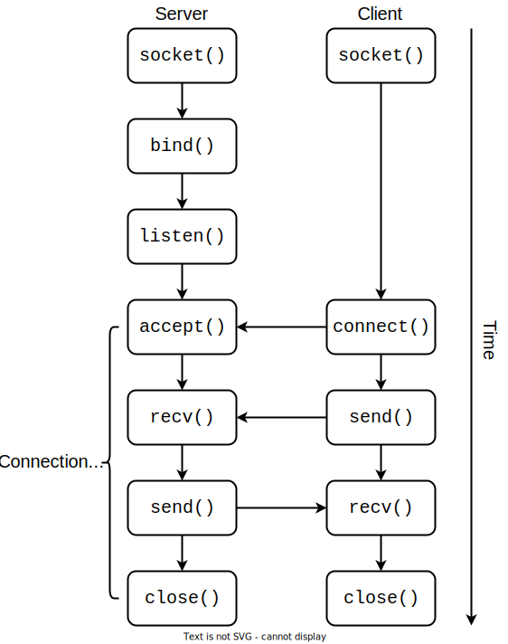

# Client-Server Model

Up to now, we've avoided code snippets using TCP.
Not anymore.
Keep in mind that all socket functions in the Berkeley API have very detailed and informative `man` pages.
For example, here are the `man` pages for [`sendto()`](https://linux.die.net/man/2/sendto) and [`recvfrom()`](https://linux.die.net/man/2/recvfrom) that are used with UDP sockets.

Going back to our [initial example](./remote-io.md#one-browser---many-connections) with how the browser gets data from <https://open-education-hub.github.io/operating-systems/>, by now we know the preferred method for transferring text is TCP.

Unlike UDP, TCP is **connection-oriented**.
This is why, in the example with the browser, we kept using the word **connection**.
What's different from UDP is that this connection is **bidirectional**, so we can both [`send()`](https://man7.org/linux/man-pages/man2/send.2.html) and receive ([`recv()`](https://man7.org/linux/man-pages/man2/recv.2.html)) data from it.
Notice that the syscalls have changed.
We were using `sendto()` and `recvfrom()` for UDP, and now we're using `send()` and `recv()` for TCP.
And yes, despite the fact that we're using Python, these are syscalls.
You saw them in C when you solved the [challenge](./remote-io.md#practice-network-sockets-challenge).

## Server vs Client

When discussing servers and clients, the server is the passive actor.
It may have some data and wait for clients to ask for this data.
Or it may require some data and wait for clients to send it.
Either way, it is **listening** for connections.

The client is the active actor, being the one who initiates the connection.

[Quiz](../quiz/client-server-sender-receiver.md)

## Establishing the Connection

There is a series of steps that a client and most importantly a server must take to establish a TCP connection.

### Steps Taken by the Server

1. Call `socket()` to create a socket.

1. `bind()` this socket to an IP and a port.
Up to now, this is nothing new.
However, with TCP sockets, `bind()` doesn't automatically make them listen for connections.

1. Call [`listen()`](https://man7.org/linux/man-pages/man2/listen.2.html) to make the socket ready to receive connections.

1. Call [`accept()`](https://man7.org/linux/man-pages/man2/accept.2.html) to set up one connection initiated by a client.
From now, the connection is established.
`accept()` returns a new socket, which will be further used for communication between the server and the client.

1. Exchange messages with the client.
The server can both read messages from the client and send responses back using the same socket returned by `accept()`.
When done, `close()` the socket returned by accept and repeat from step `4`.

### Steps Taken by the Client

1. Call `socket()` to create a socket.

1. Use [`connect()`](https://man7.org/linux/man-pages/man2/connect.2.html) to... you guessed it: connect to the server.
This step is like an "answer" to step `4` from the server.
We can say that the server `accept()`s a `connect()` request from the client.

1. Exchange messages with the server.
The client can both send messages to the server and read responses from it using the same socket created during step `1`.

Below is an image summarising the steps above:

### Practice: Client

Navigate to `support/client-server/`.
Here you will find a minimalistic server implementation in `server.py`.

1. Read the code and identify the steps outlined above.

1. Now fill in the code in `client.c` or `client.py` to be able to send messages to the server and receive responses from it.
Run multiple clients.

1. Run the code, then run `lsof` and `netstat` in other terminals to identify the file descriptor corresponding to the listening file descriptor.

## Practice: Just a Little Bit More Deluge

We've already said that Deluge uses an [abstraction over TCP](./networking-101.md#practice-encapsulation-example-deluge-revived) to handle socket operations, so we don't have the luxury of seeing it perform remote I/O "manually".
However, there are a few instances where Deluge uses socket operations itself, mostly for testing purposes.

Deluge saves its PIDs (it can spawn multiple processes) and ports in a file.
Find the `is_daemon_running()` method.
This method uses the aforementioned file to check if a given process is Deluge or some other process.
To do this, it `connect()`s to that process's socket.
If it can't, then that process is not Deluge.
Otherwise, it is Deluge and that connection is immediately closed :))
This may sound like a stupid way of checking whether a process is Deluge or not, but _if it's stupid and it works, then it's not stupid!_
