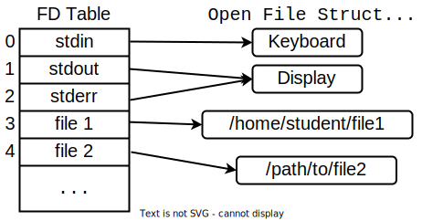

# File Descriptors

After running the code in the ["File Handlers" section](./file-handlers.md), you saw that `open()` returns a **number**.
This number is a **file descriptor**.
Run the code above multiple times.
You'll always get file descriptor 3.
We can already tell these numbers have some meaning and aren't just some seemingly random numbers, like PIDs were.

You've most likely used file descriptors before without knowing.
Remember the following concepts:

- `stdin` (standard input)
- `stdout` (standard output)
- `stderr` (standard error)

When you wanted to run a shell command and ignore its errors, you wrote something like:

```console
student@os:~$ ls 2> /dev/null
```

The command above uses `2> /dev/null` to **redirect** `stderr` to /dev/null.

[Quiz](../quiz/stderr-fd.md)

Good, so we know that `stderr` is file descriptor 2.
The code in `support/file-descriptors/open_directory.c` opened the directory as file descriptor 3.
So what are file descriptors 0 and 1?
They are `stdin` and `stdout`, respectively.

Now we know that the basic I/O streams of a process correspond to specific file descriptors.
But what is a file descriptor exactly?
From the application's point of view, it is a positive integer acting as a unique identifier for an I/O channel, such as a file.
To the operating system, a file descriptor is an index.
Each process has what's called a **file descriptor table**, which is just a fancy name for an array of pointers.
A file descriptor is an index in this array.
Each element in this array points towards a structure in the kernel's memory that represents an I/O resource.
This structure is called the **open file structure**.

To illustrate all this information, look at the image below.
All data structures shown below are stored in the Kernel's memory area and are transparent to the user space.
And remember that the file descriptor table is bound to the process, so all its threads share the same file descriptors.



To find out more about the contents of these structures, check out [this section in the Arena](./arena.md#open-file-structure-in-the-kernel)

## Creating New File Descriptors

We already know that each process gets 3 file descriptors "by default":

- `stdin` (standard input): 0
- `stdout` (standard output): 1
- `stderr` (standard error): 2

To create new file descriptors (i.e. open new files), a process can use the [`open()`](https://man7.org/linux/man-pages/man2/open.2.html) system call.
It receives the path to the file, some flags which are akin to the `mode` string passed to `fopen()`.
An optional `mode` parameter that denotes the file's permissions if the `open` must create it can also be provided.
We'll revisit `open()`'s `mode` parameter in the future.

From now, you should consult [`open()`'s man page](https://man7.org/linux/man-pages/man2/open.2.html) whenever you encounter a new argument to this syscall.
Navigate to `support/file-descriptors/open_read_write.c`.
The function `open_file_for_reading()` calls `open()` with the `O_RDONLY` flag, which is equivalent to opening the file with `fopen()` and setting `"r"` as the `mode`.
This means read-only.
Note that the file descriptor we get is 3, just like before.

Then `read_from_file()` reads `bytes_to_read` bytes from this file.
For this, it uses the `read()` syscall.
It returns the number of bytes that were read from the file.

Notice that the code doesn't simply call `read(fd, buff, bytes_to_read)`.
Instead, it uses a `while` loop to read data from the file.

The [return value of `read()`](https://man7.org/linux/man-pages/man2/read.2.html#RETURN_VALUE) may be less than `bytes_to_read` if there are not enough bytes available or if the operation is interrupted by a signal.
A return value between **0** and `bytes_to_read` is not enough to decide whether we should stop reading.
To determine this, we make another `read()` call, which will return **0** if the cursor is already at **EOF** (end of file).

The same goes for `write()`: its return value may differ from the intended number of bytes to write.
Partial writes should also be handled at the application level, and the way to do this is by using loops.

**Remember:**
**It is mandatory that we always use `read()` and `write()` inside `while` loops.**
Higher-level functions like `fread()` and `fwrite()` also use `while` loops when calling `read()` and `write()` respectively.

### Practice: Open a File for Writing

Follow the code in `open_file_for_reading()` and fill in the function `open_file_for_writing()`.
The file `write_file.txt` doesn't exist.
`open()` should create it.
Use the `open()`'s man page to find the flags you require.
Do you require anything _else_?

At this point, depending on what flags you passed to `open()`, a few things might happen.
Work your way through the errors until successfully create and open the file.
The `open()` syscall should return file descriptor 4.

Now verify the file.
This part may be different on your system.
Delete `write_file.txt` and rerun `open_read_write` a few times.
Each time, check the permissions of `write_file.txt`.
They may be different between runs, or they may always be the same.
Anyway, they are likely not the default permissions for a regular file (`rw-r--r--`).
It is not mandatory that you get the same output as below.

```console
student@os:~/.../lab/support/file-descriptors$ ls -l
total 11
drwxrwxr-x 1 student student 4096 Nov 20 18:26 ./
drwxrwxr-x 1 student student    0 Nov 20 14:11 ../
-rw-rw-r-- 1 student student   46 Nov 20 17:27 .gitignore
-rw-rw-r-- 1 student student  125 Nov 20 18:26 Makefile
-rw-rw-r-- 1 student student  396 Nov 20 11:27 open_directory.c
-rw-rw-r-- 1 student student 2210 Nov 20 17:24 open_read_write.c
-rw-rw-r-- 1 student student  34 Nov 20 18:26 read_file.txt
---------- 1 student student  45 Nov 20 18:26 write_file.txt
```

[Quiz](../quiz/write-file-permissions.md)

**Remember:**
**It is mandatory that we pass a `mode` argument to `open()` when using the `O_CREAT` flag.**

Now pass some sensible `mode` argument to `open()`, such as `0644` (for `rw-r--r--` permissions).

### Practice: Write to the File

Follow the example in `read_from_file()` to fill in `write_to_file()`.
Remember to use a loop to make sure your data is fully written to the file.

1. Use `cat write_file.txt` to check if the file contains the right data.

1. Use `open_file_for_reading()` and `read_from_file()` to reopen `write_file.txt` for reading and read the bytes you've just written to it.

## Replace or Truncate?

### Practice: Write Once More

Change the message written to `write_file.txt` by `support/file-descriptors/open_read_write.c` **to a shorter one**.
It is important that the new message be shorter than the first one.
Now recompile the code, then run it, and then inspect the contents of the `write_file.txt` file.

If the new message were `"Something short"`, the contents of `write_file.txt` should be:

```console
student@os:~/.../lab/support/file-descriptors$ cat ../../support/file-descriptors/write_file.txt
Something shorte_file.txt: What's up, Doc?
```

Note that the final bytes of the previous text remain unchanged.
The new message was simply written **on top** of the old one.

Now let's do a quick test.
We haven't talked about how redirections work in the terminal (we'll get there, step by step), but you can imagine that if you type `ls > file.txt`, `file.txt` has to be opened at some point.
Let's write data to a file twice and observe the behaviour:

```console
student@os:~/.../lab/support/file-descriptors$ ls -l > file.txt

student@os:~/.../lab/support/file-descriptors$ cat file.txt
total 6
-rw-rw-r-- 1 student student    0 Nov 20 21:11 file.txt
-rw-rw-r-- 1 student student  125 Nov 20 18:26 Makefile
-rw-rw-r-- 1 student student  396 Nov 20 21:10 open_directory.c
-rw-rw-r-- 1 student student 2300 Nov 20 20:51 open_read_write.c
-rw-rw-r-- 1 student student   34 Nov 20 18:26 read_file.txt
-rw-r--r-- 1 student student   45 Nov 20 20:56 write_file.txt

student@os:~/.../lab/support/file-descriptors$ ls > file.txt

student@os:~/.../lab/support/file-descriptors$ cat file.txt
file.txt
Makefile
open_directory.c
open_read_write.c
read_file.txt
write_file.txt
```

The second output is shorter than the first, yet the first output is no longer present in the file after the second `ls`.
How come?
Well, the reason is another flag being passed to `open()`: `O_TRUNC`.
At this point, you should be accustomed to looking for this flag in `open()`'s man page.
Go ahead and do it.

[Quiz 1](../quiz/o-trunc.md)

[Quiz 2](../quiz/fopen-w.md)

### Practice: Close'em All

Just like you use `open()` to create new file descriptors, you can use [`close()`](https://man7.org/linux/man-pages/man2/close.2.html) to destroy them.
This clears and frees the open file structure to which that entry in the file descriptor table is pointing.
Use `close()` on the file descriptors you've opened so far in `support/file-descriptors/open_read_write.c`.

Note that you don't have to close file descriptors 0, 1 and 2 manually.
The standard streams are meant to stay alive throughout the lifetime of the process.
Just like calling `free()` on a `malloc()`-ed pointer, calling `close()` is not really necessary.
When a process terminates, the OS closes all its file descriptors the same way it frees all its memory.

And keeping this comparison with `malloc()` and `free()`, closing file descriptors is important when they are created inside a loop, as the file descriptor table's size is limited.

## File Handling Conclusion: libc vs syscalls

Up to now, we can draw some parallels between `fopen()` and `open()`.
While `fopen()` allows the usage of high-level functions such as `fread()` and `fwrite()`, which, among other things, use `while` loops to ensure they always read the required number of bytes, the libc-specific API is not generic enough.

In the following sections, we'll use file descriptors and `read()` and `write()` to interact with some inter-process-communication mechanisms, such as pipes.

The table below shows the higher level API provided by libc and the syscalls it relies on.
As usual, use the `man` pages when in doubt about either of them.

|    libc    |  syscall  |
| :--------: | :-------: |
| `fopen()`  | `open()`  |
| `fread()`  | `read()`  |
| `fwrite()` | `write()` |
| `fseek()`  | `lseek()` |
| `fclose()` | `close()` |

So for most equivalents, just remove the leading `f` when moving from the libc function to the underlying syscall.

For a quick recap of the flags we've discussed so far, take a look at the following table.
But don't bother memorising it.
You can find it any time in by typing [`man fopen`](https://man7.org/linux/man-pages/man3/fopen.3.html) in your terminal.

| `fopen()` mode |          `open()` flag          |
| :------------: | :-----------------------------: |
|     `"r"`      |           `O_RDONLY`            |
|     `"w"`      | `O_WRONLY │ O_CREAT │ O_TRUNC`  |
|     `"a"`      | `O_WRONLY │ O_CREAT │ O_APPEND` |
|     `"r+"`     |            `O_RDWR`             |
|     `"w+"`     |  `O_RDWR │ O_CREAT │ O_TRUNC`   |
|     `"a+"`     |  `O_RDWR │ O_CREAT │ O_APPEND`  |
