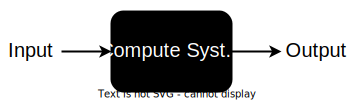

# Introduction

We know that a compute system is a collection of hardware and software that modifies data.
This data has to come from _somewhere_.
This _somewhere_ is always outside the compute system:
files, network packets, radio signals, sensor data.

A compute system without output is nearly useless.
It will always run the same code on the same data and, thus, produce the same result.
This may be useful in some narrow cases, such as calculating the decimals of Pi.
However, for more real-world-facing applications such as web servers, operating systems and databases inputs and outputs are mandatory.

The most simplistic representation of a compute system is a black box that receives some input and delivers some output.

In this session we will look into how a compute system interacts with the outside world to get and produce these inputs and outputs.
