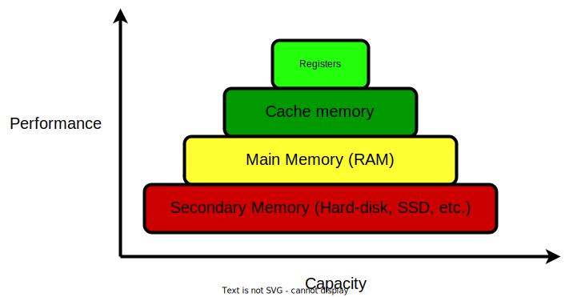

# I/O Internals

Now we will take a short look at how the file descriptors you've just learnt about are handled in libc.
The Software Stack chapter has taught us that applications generally interact with libraries which expose wrappers on top of syscalls.
The most important library in a POSIX system (such as Linux) is libc.
Among many others, it provides higher-level abstractions over I/O-related syscalls.

**Musl** (read just like "muscle") is a lightweight implementation of libc, which exposes the same API that you have used so far, while also being fit for embedded and OS development.
For example, [Unikraft](https://unikraft.org/) [unikernels](https://unikraft.org/docs/concepts/) may [use musl](https://github.com/unikraft/lib-musl).

First, it provides a `struct` that groups together multiple data that is necessary when handling files.
We know from the example in `support/simple-file-operations/file_operations.c` that the file handler employed by libc is `FILE *`.
`FILE` is just a `typedef` for [`struct _IO_FILE`](https://elixir.bootlin.com/musl/v1.2.3/source/src/internal/stdio_impl.h#L21).
Here are the most important fields in `struct _IO_FILE`:

```c
struct _IO_FILE {
        int fd;         /* File descriptor */

        unsigned flags; /* Flags with which `open()` was called */

        int mode;       /* File permissions; passed to `open()` */

        off_t off;      /* File offset from where to read / write */

        /**
         * Internal buffer used to make fewer costly `read()`/`write()`
         * syscalls.
         */
        unsigned char *buf;
        size_t buf_size;

        /* Pointers for reading and writing from/to the buffer defined above. */
        unsigned char *rpos, *rend;
        unsigned char *wend, *wpos;

        /* Function pointers to syscall wrappers. */
        size_t (*read)(FILE *, unsigned char *, size_t);
        size_t (*write)(FILE *, const unsigned char *, size_t);
        off_t (*seek)(FILE *, off_t, int);
        int (*close)(FILE *);

        /* Lock for concurrent file access. */
        volatile int lock;
};
```

As you might have imagined, this structure contains the underlying file descriptor, the `mode` (read, write, truncate etc.) with which the file was opened, as well as the offset within the file from which the next read / write will start.

Libc also defines its own wrappers over commonly-used syscalls, such as `read()`, `write()`, `close()` and `lseek()`.
These syscalls themselves need to be implemented by the driver for each file system.
This is done by writing the the required functions for each syscall and then populating [this structure](https://elixir.bootlin.com/linux/v6.0.9/source/include/linux/fs.h#L2093) with pointers to them.
You will recognise quite a few syscalls: `open()`, `close()` `read()`, `write()`, `mmap()` etc.

## IO Optimisations

You saw this hierarchy during the Data lecture:



It says that while the disk can store lots of data, it does so at the cost of speed.
When we say speed, we mean the rate at which we can read/write data from/to the disk, i.e. the maximum number of bytes transferred per unit of time.
This means that `read()` and `write()` syscalls (or their various corresponding library calls) are slow and cause performance bottlenecks.
More often than not it is the I/O component that drags down the performance of an otherwise fast application.
And what's worse, the further the "destination" of the I/O operation (file on the disk or host on the Web) is, the more time it takes to transfer data to and form it.

On the other hand, as we've already established, the I/O component defines how we interact with an app.
If we want it to be responsive and to do something useful, most likely, the I/O is the key.

So I/O is crucial for most applications, yet it is also the slowest...


But fear not!
There are countless optimisations out there aimed precisely at bridging the speed gap between the memory and the disk.

### I/O Buffering

Going back to our initial example with [`struct _IO_FILE`](https://elixir.bootlin.com/musl/v1.2.3/source/src/internal/stdio_impl.h#L21) from Musl, we can see some more fileds:

```c
unsigned char *buf;
size_t buf_size;
unsigned char *rpos, *rend;
unsigned char *wend, *wpos;
```

Given the number `unsigned char *` fields we have in this structure, it seems there is some heavy _buffering_ going on.
But what is it?

#### Practice: `printf()` Buffering

1. Navigate to `support/buffering/printf_buffering.c`.
Those `printf()` calls obviously end up calling `write()` at some point.
Run the code under `strace`.

[Quiz](../quiz/strace-printf.md)

Since there is only one `write()` syscall despite multiple calls to `printf()`, it means that the strings given to `printf()` as arguments are kept _somewhere_ until the syscall is made.
That _somewhere_ is precisely that buffer inside `struct _IO_FILE` that we highlighted above.
Remember that syscalls cause the system to change from user mode to kernel mode, which is time consuming.
Instead of performing one `write()` syscall per call to `printf()`, it is more efficient to copy the string passed to `printf()` to an **internal buffer** inside libc (the `unsigned char *buf` from above) and then at a given time (like when the buffer is full for example) `write()` the whole buffer.
This results in far fewer `write()` syscalls.

<!-- markdownlint-disable MD029 -->

2. Now it is interesting to see how we can force libc to dump that internal buffer.
The most direct way is by using the `fflush()` library call which is made for this exact purpose.
But we can be more subtle.
Add a `\n` in some of the strings printed in `support/buffering/printf_buffering.c`.
Place them wherever you want (at the beginning, at the end, in the middle).
Recompile the code and observe its change in behaviour under `strace`.

<!-- markdownlint-enable MD029 -->

[Quiz](../quiz/flush-libc-buffer.md)

Now we know that I/O buffering **does happen** within libc.
If you need further convincing, check out the Musl implementation of [`fread()`](https://elixir.bootlin.com/musl/v1.2.3/source/src/stdio/fread.c#L6), for example.
It first copies the [data previously saved in the internal buffer](https://elixir.bootlin.com/musl/v1.2.3/source/src/stdio/fread.c#L16):

```c
if (f->rpos != f->rend) {
        /* First exhaust the buffer. */
        k = MIN(f->rend - f->rpos, l);
        memcpy(dest, f->rpos, k);
        f->rpos += k;
        dest += k;
        l -= k;
}
```

Then, if more data is requested and the internal buffer isn't full, it refills it using [the internal `read()` wrapper](https://elixir.bootlin.com/musl/v1.2.3/source/src/stdio/fread.c#L27).
This wrapper also places the data inside the destination buffer.

#### Practice: Buffering Performance

Up to know it's pretty clear what I/O buffering is about.
Let's see what kind of a performance increase it brings.
We'll look at an extreme example.
Navigate to `support/buffering/no_buffering.c`.
This code either writes or reads the contents of a file **one byte at a time** using a syscall for each of them.

Use the `benchmark_buffering.sh` script to compare the `no_buffering` and `libc_buffering` implementations.
Below are some possible results.
Yours are likely going to be different:

```console
student@os:/.../support/buffering$
======== Testing no_buffering ========
Testing no_buffering read...
Read 1048576 bytes from test-file.txt in 717 ms
Testing no_buffering write...
Wrote 1048576 bytes to test-file.txt in 19632 ms
======== Testing libc_buffering ========
Testing libc_buffering read...
Read 1048576 bytes from test-file.txt in 14 ms
Testing libc_buffering write...
Wrote 1048576 bytes to test-file.txt in 38 ms
```

<!-- markdownlint-disable MD104 -->

So buffering brings a **98%** improvement for reading and a **99.8%** improvement for writing!
This is massive!
Yes, this is an extreme example, but it goes a long way to show how powerful I/O buffering can be.
Now the question is "Can YOU do better?"

<!-- markdownlint-enable MD104 -->

### Practice: DIY Buffering

1. Navigate to `support/buffering/diy_buffering.c`.
`diy_fread()` already defines a minimalistic implementation of `fread()`.
Use it as a starting point to implement `diy_write()` as an implementation of `fwrite()`.

1. Run `benchmark_buffering.sh` to comapre the performance of your implementation with that of libc.
Did you beat it?

## Conclusion

I/O Buffering is a ubiquitous optimisation in all libc implementations.
It is so powerful that the kernel uses it as well.
This means that the kernel also reads more bytes than it's requested and stores the remainder in an internal buffer, just like libc.
This concept is know as **double buffering**.
In the [following section](./zero-copy.md) we will see how to make use of this internal buffering to optimise network requests.

Notice that the script in `support/buffering/benchmark_buffering.sh` also uses `echo 3 > /proc/sys/vm/drop_caches`.
That section [in the Arena](./arena.md#to-drop-or-not-to-drop) that we mentioned earlier is becoming even more interesting.
