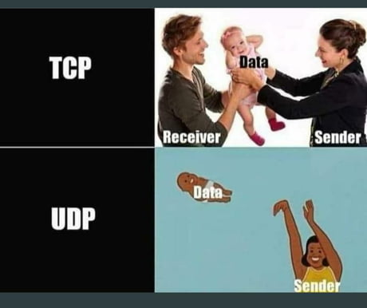

# Networking 101

In this section, we will **briefly** explore how networking works in general, from the perspective of the application.
Understanding the details of it, however, is beyond the scope of this course.

The main **protocols** used by applications are **User Datagram Protocol (UDP)** and **Transmission Control Protocol (TCP)**.
We can specify this protocol when creating a socket.

## UDP

UDP is the simpler of the two protocols above.
It simply states that the sender should pass the data over to the receiver specified by an IP and a port.
The scripts in `support/send-receive/` both used UDP.
You can tell by the fact they both created their sockets like so:

```Python
sock = socket.socket(socket.AF_INET, socket.SOCK_DGRAM)
```

<!-- markdownlint-disable-next-line MD101 -->
The `socket.SOCK_DGRAM` argument stands for "datagram" and specifies UDP.

It doesn't care whether the receiver has got all the data, whether it was corrupted or dropped altogether by some router along the way.

To prove this, rerun `support/send-receive/receiver.py`, then run `support/send-receive/sender.py`, type `"exit"` and then run `sender.py` again.
You'll see no error from the sender because whether the message reaches its destination or not is not important for UDP.

So far UDP might seem rather useless.
It doesn't confirm whether a message was received correctly or not, so why use it?
Well, exactly because its mechanism is so simple, UDP is **fast**.
Therefore, it is used by many **real-time services**, such as for streaming or video calls where if a frame drops or is incorrect, it doesn't really matter that much since it will immediately be replaced with the next frame, thus masking the error.

## TCP

TCP is the polar opposite of UDP.
TCP makes sure the data is given to the application correctly by performing error checks on the receiving end and then retransmitting any incorrect or missing messages.
For this reason, TCP is good for applications that require precise data, such as banking applications, static images or text.
The cost of correctness, however, is transmission speed.

### Practice: Encapsulation Example: Deluge Revived

[Quiz](../quiz/deluge-tcp-udp.md)

You haven't forgotten about our favourite Bittorrent clint, [Deluge](https://deluge-torrent.org/), have you?
It implements its own protocol for transferring data.
It is built on top of TCP using the [`ITCPTransport` interface](https://twisted.org/documents/18.7.0/api/twisted.internet.interfaces.ITCPTransport.html).

1. In the Deluge codebase, find the class `DelugeTransferProtocol` and read the docstring comment about the format of its messages.

1. Follow the code in the `transfer_message()` method of the `DelugeTransferProtocol` class and see the `message` variable conform to the message format you've just read about.
`self.transport` simply refers to the underlying TCP interface.
So `self.transport.write()` invokes the whole socket creation boilerplate necessary to send data via TCP.
We'll discuss it in the [next section](./client-server-model.md#establishing-the-connection).

This is what protocols are mostly about.
They describe which fields go where within a message and how they should be interpreted.
For example, this protocol says that the `body` (the data itself) should be compressed before being sent.
This makes a lot of sense, as sending less data over the network results in lower latencies.
However, if encryption is too time-consuming, it may not be worth it.
There are compromises to be made everywhere.

## Local TCP and UDP Services

To get a full list of all network-handling processes in your system together with the protocols they're using, we can use the `netstat` with the `-tuanp` arguments.
`-tuanp` is short for `-t -u -a -n -p`, which stand for:

- `-t`: list processes using the TCP protocol
- `-u`: list processes using the UDP protocol
- `-a`: list both servers and clients
- `-n`: list IPs in numeric format
- `-p`: show the PID and name of each program

```console
student@os:~$ sudo netstat -tunp
Active Internet connections (w/o servers)
Proto Recv-Q Send-Q Local Address           Foreign Address         State       PID/Program name
tcp        0      0 0.0.0.0:22              0.0.0.0:*               LISTEN      1057/sshd: /usr/sbi
tcp        0      0 127.0.0.1:6463          0.0.0.0:*               LISTEN      3261/Discord --type
tcp        0      0 192.168.100.2:51738     162.159.128.235:443     ESTABLISHED 3110/Discord --type
tcp        0      0 192.168.100.2:43694     162.159.129.235:443     ESTABLISHED 3110/Discord --type
tcp        0      0 192.168.100.2:56230     54.230.159.113:443      ESTABLISHED 9154/firefox
tcp        0      0 192.168.100.2:38096     34.107.141.31:443       ESTABLISHED 9154/firefox
tcp        0      0 192.168.100.2:42462     34.117.237.239:443      ESTABLISHED 9154/firefox
tcp        0      0 192.168.100.2:41128     162.159.135.234:443     ESTABLISHED 3110/Discord --type
tcp6       0      0 :::80                   :::*                    LISTEN      1114/apache2
tcp6       0      0 :::22                   :::*                    LISTEN      1057/sshd: /usr/sbi
tcp6       0      0 2a02:2f0a:c10f:97:55754 2a02:2f0c:dff0:b::1:443 ESTABLISHED 9154/firefox
tcp6       0      0 2a02:2f0a:c10f:97:55750 2a02:2f0c:dff0:b::1:443 ESTABLISHED 9154/firefox
udp        0      0 0.0.0.0:56585           0.0.0.0:*                           3261/Discord --type
udp        0      0 0.0.0.0:42629           0.0.0.0:*                           3261/Discord --type
udp6       0      0 :::52070                :::*                                9154/firefox
udp6       0      0 :::38542                :::*                                9154/firefox
```

Obviously, your output will differ from the one above.
First look at the fourth column.
It shows the local address and port used by the process.
As we've already established, SSH uses port 22.
Apache2 uses port 80 for both IPv4 and IPv6 addresses (look for rows starting with `tcp` for IPv4 and `tcp6` for IPv6).
Port 80 is used for the HTTP protocol.

Moving on to some user programs, Firefox runs multiple connections using both IPv4 and IPv6 and a different port for each connection.

[Quiz](../quiz/firefox-tcp-udp.md)

Discord does the same things as Firefox.
It uses TCP to send text messages, memes, videos and static content in general.
And at the same time, it uses UDP to exchange voice and video data during calls.

### Practice: Run `netstat` Yourself

1. Run `netstat` on your own host machine.
Identify processes that use TCP and UDP and try to figure out what they might be using these protocols for.
Look for browsers (different sites and types of content), servers such as Apache2 or Nginx, online games etc.
Discuss your findings with your classmates and teacher(s).

1. Now run `receiver.py` and then run `netstat` in another terminal to see your receiver process.
What arguments do you need to pass to `netstat` to see `receiver.py`?
Do you need the whole `-tuapn`?
No.

### Conclusion

The difference between TCP and UDP can be summarised as follows:


