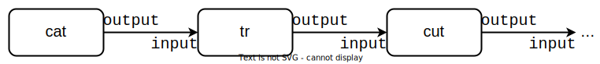

# Pipes

When it comes to inter-process communication, so far we know that 2 different processes can `mmap()` the same file and use that as some sort of shared memory, but this requires writing data to the disk which is slow.
Then we know they can `wait()`/`waitpid()` for each other to finish, or better yet, use shared semaphores or mutexes, but these mechanisms aren't good at passing data between processes.
So our goals for this session are to learn how to use an IPC (inter-process communication) mechanism that:

- allows transfers between processes, not notifications

- is faster than reading and writing from/to files

## Anonymous Pipes - `pipe()`

Have you ever wondered how Bash handles redirecting the `stdout` of a command to the `stdin` of the next command in one-liners such as:

```bash
cat 'log_*.csv' | tr -s ' ' | cut -d ',' -f 2 | sort -u | head -n 10
```

The `stdout` of `cat` is the `stdin` of `tr`, whose `stdout` is the `stdin` of `cut` and so on.
This "chain" of commands looks like this:



So here we have a **unidirectional** stream of data that starts from `cat`, is modified by each new command, and then is passed to the next one.
We can tell from the image above that the communication channel between any 2 adjacent commands allows one process to write to it while the other reads from it.
For example, there is no need for `cat` to read any of `tr`'s output, only vice versa.

Therefore, this communication channel needs 2 ends:
one for reading (from which commands get their input) and another for writing (to which commands write their output).
In UNIX, the need for such a channel is fulfilled by the [`pipe()` syscall](https://man7.org/linux/man-pages/man2/pipe.2.html).
Imagine there's a literal pipe between any 2 adjacent commands in the image above, where data is what flows through this pipe **in only a single way**.
This is why the `|` operator in Bash is called pipe and why the syscall is also named `pipe()`.

This type of pipe is also called an **anonymous pipe**, because it cannot be identified using a name (i.e. it is not backed by any file).
The data written to it is kept in a circular buffer inside the kernel from where it can be then read by the child process.
This is faster than writing data to a file, so we achieve both our [initial goals](#pipes).

## Practice: Find the Right ~~Hole~~ File Descriptor

Navigate to `support/pipes/anonymous_pipe.c`.
Compile and run the code.
In another terminal, use `lsof` to see:

- the file descriptors opened by the parent process between the creation of the pipe and the call to `fork()`

- the file descriptors opened by the child process

[Quiz](../quiz/pipe-ends.md)

A simple way to memorise which pipe end is which is to think about `stdin` and `stdout`, respectively.
`stdin` is file descriptor 0 and is mostly for reading and `pipedes[0]` is also for reading.
Conversely, `stdout` is file descriptor 1 and is meant for writing, just like `pipedes[1]`.
Now you won't confuse them.

### Practice: Inheritance

An important thing to take note of before we actually use pipes is that file descriptors are **inherited** by the child process from the parent.
So if the parent opens some file descriptors (like, say, for a pipe), the child will also be able to use them.
Don't believe us?

Modify the code in `support/pipes/anonymous_pipes.c` and call `wait_for_input()` from the child process.
Then use `lsof` again with the PID of the child process to make sure file descriptors 3 and 4 are still open.

### Practice: Now We Pipe

Now comes the moment you've most likely been waiting for.
The code in `support/pipes/anonymous_pipes.c` wants to create something like a client-server dynamic between the parent and the child.
The parent reads data from `stdin` and sends it to the child via the pipe they share.
The client (parent) ends communication when you type `"exit"`.

You can comment out the calls to `wait_for_input()` if you find them annoying.

Sample output:

```console
student@os:~/.../support/pipes$ ./anonymous_pipe
pipedes[0] = 3; pipedes[1] = 4
 * pipe created
 -- Press ENTER to continue ...
echo
[Child received]: echo
echo
[Child received]: echo
to pipe, or not to pipe
[Child received]: to pipe, or not to pipe
```

### Practice: Receive Pipes

Use your knowledge of pipes to solve a CTF challenge.
Navigate to `support/receive-challenges` and look into the files `receive_pipe.c` and `send_fd_4.c`.
Modify `receive_pipe.c` so that it creates a pipe, then spawns a child process.
The child will redirect file descriptor 4 to `stdout` and then `execlp()` `send_fd_4`.
`send_fd_4` writes the flag to file descriptor 4 (`pipefd[1]`), so the parent process needs to read it from `pipedefd[0]`.

Once you do this, note that file descriptors are also maintained after calling `exec()` to run a completely new program.

Now, if you want to use pipes even more, go over to [the Arena](./arena.md#mini-shell-with-blackjack-and-pipes) and add support for pipes to the mini-shell you've previously worked on.

### Anonymous Pipes: Conclusion

Anonymous pipes give allow us to efficiently transmit data between 2 processes, as no disk access is required.
However, they still have one major limitation.

[Quiz](../quiz/anonymous-pipes-limitation.md)

The answer to this is to employ _some_ filesystem support.

## Named Pipes - `mkfifo()`

We will give up on some performance by writing data to a file, but the reading and writing to the file must behave just like using a named pipe:

- reading doesn't block while there's still data in the pipe
- reading from an empty pipe stalls the current thread until data becomes available.
This is one of the cases where `read()` might not return as many bytes as we requested.
Remember:
always use loops with `read()` and `write()`

Because this pipe uses a file, which must have a name, it is called a **named pipe**.

### Practice: From the CLI

First, let's use named pipes from the terminal.
Use the `mkfifo` command to create one such file:

```console
student@os:~$ mkfifo fifo

student@os:~$ ls -l fifo
prw-rw-r-- 1 student student 0 Nov 22 23:20 fifo|
```

The fact that pipes are also called FIFOs should come as no surprise.
They act like queues/FIFOs:

- you add data to one end (push/enqueue)
- you extract data from the other (pop/dequeue)

Also note the `p` at the beginning of the output above.
It symbolises the type of this file:
a named **pipe**.

Now let's use it.
Open 2 terminals.

1. In the first one, use `cat` to read from `fifo`.
Note that the command is blocked because the pipe is empty, so `cat` has nothing to read.
Then, in the second terminal, write some message to `fifo` using `echo`.
In the first terminal, you should see that `cat` has finished, and the message has appeared there.

1. Now do it the other way around:
first `echo` some string into the pipe and **then** read it with `cat`.
Note that now the `echo` command is blocked.
Now `cat` should end immediately, and the string should appear because we have already placed some data in the pipe.
Also, the previous `echo` should finish now.

**Remember:**
**Reading from a pipe blocks while the pipe is empty.**
**Writing to a pipe blocks until it is empty.**

### Practice: From the Code - Receive FIFO

The libc function with which we can create named pipes is...
[`mkfifo()`](https://man7.org/linux/man-pages/man3/mkfifo.3.html).
You weren't expecting this, were you?
Its underlying syscall is [`mknod()`](https://man7.org/linux/man-pages/man2/mknodat.2.html), which simply creates a file of whatever type we specify, but that's besides the point.

Navigate to `support/receive-challenges/` and look into `receive_fifo.c` and `send_fifo.c`.
Follow the `TODO`s in the former file to read the flag that the latter writes into the named pipe.
Note that after you create the named pipe, you have to read from it like you would from any regular file.

### Named Pipes: Conclusion

It is nice to remember that named pipes sacrifice little to no performance when compared to anonymous pipes.
While it may seem that the data being passed through them is written to the disk, then read and overwritten, this is not the case.
The FIFO file is just a handler within the filesystem that is used to write data to a buffer inside the kernel.
This buffer holds the data that is passed between processes, not the filesystem.
So we still don't break our 2 desires from the beginning of this section:
to allow data transfer and to do so efficiently.
