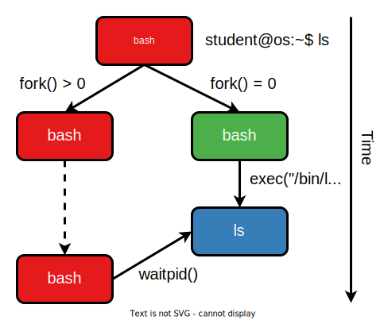

# Redirections

In the [File Descriptors section](./file-descriptors.md), we mentioned redirections such as `ls > file.txt`.
We said `file.txt` has to be opened at some point.
Let's check that.
We'll use `strace`, obviously, to look for for `open()` and `openat()` syscalls.

```console
student@os:~/.../lab/support/simple-file-handling$ strace -e open,openat ls > file.txt
openat(AT_FDCWD, "/etc/ld.so.cache", O_RDONLY|O_CLOEXEC) = 3
openat(AT_FDCWD, "/lib/x86_64-linux-gnu/libselinux.so.1", O_RDONLY|O_CLOEXEC) = 3
openat(AT_FDCWD, "/lib/x86_64-linux-gnu/libc.so.6", O_RDONLY|O_CLOEXEC) = 3
openat(AT_FDCWD, "/lib/x86_64-linux-gnu/libpcre2-8.so.0", O_RDONLY|O_CLOEXEC) = 3
openat(AT_FDCWD, "/lib/x86_64-linux-gnu/libdl.so.2", O_RDONLY|O_CLOEXEC) = 3
openat(AT_FDCWD, "/lib/x86_64-linux-gnu/libpthread.so.0", O_RDONLY|O_CLOEXEC) = 3
openat(AT_FDCWD, "/proc/filesystems", O_RDONLY|O_CLOEXEC) = 3
openat(AT_FDCWD, "/usr/lib/locale/locale-archive", O_RDONLY|O_CLOEXEC) = 3
openat(AT_FDCWD, ".", O_RDONLY|O_NONBLOCK|O_CLOEXEC|O_DIRECTORY) = 3
```

This looks strange.
Where is the call to `openat(AT_FDCWD, "file.txt", ...)`?
Well if we look at the full `strace` output, the first call is `execve()`:

```console
student@os:~/.../lab/support/simple-file-handling$ strace ls > file.txt
execve("/usr/bin/ls", ["ls"], 0x7ffe550d59e0 /* 60 vars */) = 0
[...]
```

[Quiz](../quiz/execve.md)

So the `openat()` syscalls we saw earlier come fom the `ls` process.
Remeber how launching a command works in Bash:

1. The Bash process `fork()`s itself
1. The child (still a Bash process) then calls `execve()`
1. The parent (the original Bash process) calls `waitpid()` to wait for the new process to end.



So we can deduce that `file.txt` is opened by the child process **before** calling `execve()`.
Note that despite replacing the VAS of the current process, `execve()` does **NOT** replace its file descriptor table.
So whatever files were opened by the original process remain open within the new one.
This behaviour is the basis of pipes (the `|` that you use in Bash to use the output of a command as the input of another) and redirections (`>`, `<` and `2>`).

## Practice: Naive Redirection

But before diving into reimplementing shell functionalities, let's look at a simpler example.
Navigate to `support/redirect/redirect.c`.
The code makes a naive attempt at redirecting the newly opened file to `stdout`.
It simply closes `stdout` first so that when `open()` returns **the lowest available file descriptor**, that value will be 1, which is `STDOUT_FILENO`.

Note there's a difference between `stdout` and `STDOUT_FILENO`.
While `stdout` is of type `FILE *` and is meant to be used with libc functions such as `fread()`, `STDOUT_FILENO` is the default file descriptor for the standard output, which almost always is 1.
So `STDOUT_FILENO` is an `int` type with the value 1.
Don't confuse them!

Compile and run the code without modifying it.
It pauses after each file descriptor operation.
In another terminal (or in another `tmux` window), run the following each time you press Enter in the first terminal/window: `lsof -p $(pidof redirect)`.

`lsof` displays the files opened by the given process.
From the output below we see that these files are mainly files (opened as file descriptors) and libraries, which are memory mapped (`mem`).
On the third column, you can see the file descriptor corresponding to each file.

```console
student@os:~/.../lab/support/redirect$ lsof -w -p $(pidof redirect)  # before any file operations
COMMAND    PID USER   FD   TYPE DEVICE SIZE/OFF    NODE NAME
redirect 44303  student  cwd    DIR    8,1     4096  299870 /home/student/operating-systems-oer/content/chapters/io/lab/support/redirect
redirect 44303  student  rtd    DIR  259,6     4096       2 /
redirect 44303  student  txt    REG    8,1    25848  299929 /home/student/operating-systems-oer/content/chapters/io/lab/support/redirect/redirect
redirect 44303  student  mem    REG  259,6  2029592 1857435 /usr/lib/x86_64-linux-gnu/libc-2.31.so
redirect 44303  student  mem    REG  259,6   191504 1835092 /usr/lib/x86_64-linux-gnu/ld-2.31.so
redirect 44303  student    0u   CHR  136,0      0t0       3 /dev/pts/0
redirect 44303  student    1u   CHR  136,0      0t0       3 /dev/pts/0
redirect 44303  student    2u   CHR  136,0      0t0       3 /dev/pts/0
```

Notice that all 3 default file descriptors are first liked to `/dev/pts/0`.
It may be different on your machine, but most likely it will be `/dev/pts/<some_number>`.
This is a [character device](./devices.md) that signifies your current (pseudo)terminal.

```console
student@os:~/.../lab/support/redirect$ lsof -w -p $(pidof redirect)  # after closing `STDOUT_FILENO`
redirect 46906  student    0u   CHR  136,0      0t0       3 /dev/pts/0
redirect 46906  student    2u   CHR  136,0      0t0       3 /dev/pts/0
```

See that file descriptor 1 (`stdout`) has "disappeared".
Now the second entry in the process's FD table is free.

```console
student@os:~/.../lab/support/redirect$ lsof -w -p $(pidof redirect)  # after opening `redirect_file.txt`
redirect 46906  student    0u   CHR  136,0      0t0       3 /dev/pts/0
redirect 46906  student    1w   REG    8,1        0  299958 /.../lab/support/redirect/redirect_file.txt
redirect 46906  student    2u   CHR  136,0      0t0       3 /dev/pts/0
```

`open()` has assigned the newly opened file to the lowest file descriptor available, which is 1, the former `stdout`.
`printf()` writes its output to `stdout`, which in this case is `redirect_file.txt`.
Now inspect the contents of this file to make sure that string was written there.

[Quiz](../quiz/prints-work-no-stdio.md)

## Practice: Thread-unsafe Redirection

This is all fine, but it doesn't allow us to **copy** file descriptors.
We can only replace an existing file descriptor with another one.
To be able to do replacements, we can use the [`dup()`](https://man7.org/linux/man-pages/man2/dup.2.html) syscall.
It simply creates a new file descriptor that refers to the same open file `struct` as the one given to it as an argument.
Both file descriptors remain active after calling `dup()`.

Change the `do_redirect()` function in `support/redirect/redirect.c` to employ this new logic.
It should follow the steps below.
Track them using `lsof`, just like before.

Step 1:

- 0 -> `stdin`
- 1 -> `stdout`
- 2 -> `stderr`

Step 2 - after `open("redirect_file.txt", ...)`:

- 0 -> `stdin`
- 1 -> `stdout`
- 2 -> `stderr`
- 3 -> `redirect_file.txt`

Step 3 - after `close(STDOUT_FILENO)`:

- 0 -> `stdin`
- 2 -> `stderr`
- 3 -> `redirect_file.txt`

Step 4 - after `dup(3)`.
Note that now both 1 and 3 are linked to `redirect_file.txt`, so we managed to successfully copy file descriptor 3.

- 0 -> `stdin`
- 1 -> `redirect_file.txt`
- 2 -> `stderr`
- 3 -> `redirect_file.txt`

Step 5 - after `close(3)`.
We don't need file descriptor 3 at this point anymore.

- 0 -> `stdin`
- 1 -> `redirect_file.txt`
- 2 -> `stderr`

## Practice: Safe Redirection

`dup()` is all fine and dandy, but what if 2 threads use the steps above concurrently?
Because steps 3 and 4 don't happen atomically, they risk having their results inverted.
Take a look at `support/redirect/redirect_parallel.c`.
Compile and run the code, then inspect the resulting files.
You'll notice they contain opposing strings:

```console
student@os:~/.../lab/support/redirect$ cat redirect_stderr_file.txt
Message for STDOUT

student@os:~/.../lab/support/redirect$ cat redirect_stdout_file.txt
Message for STDERR
```

What happens is that thread 1 is forced to call `close(STDOUT_FILENO)`, then thread 2 calls `close(STDERR_FILENO)`.
So far, this is not problematic.
But then thread 2 continues to `dup()` `redirect_stderr.txt` into the lowest file descriptor available, which is 1 (`STDOUT_FILENO`).
Then thread 1 resumes to `dup()` `redirect_stdout.txt` into file descriptor 2 (`STDERR_FILENO`).
Thus we end up redirecting `stdout` and `stderr` to the opposite files than those we intended.

To fix this, we need to call an **atomic** syscall, called [`dup2()`](https://man7.org/linux/man-pages/man2/dup.2.html).
It receives 2 file descriptors (`dup2(src_fd, dst_fd)`) and its actions are equivalent to the following, but performed atomically:

```c
close(dst_fd);
dup(src_fd);  // This places `src_fd` into the previous `dst_fd`
```

1. Modify `support/redirect/redirect_parallel.c` and change the calls to `close()` and `dup()` to calls to `dup2()` and check the contens of the resulting files to see they're correct.

1. Now go back to `support/redirect/redirect.c` and refactor the code in `do_redirect()` to use `dup2()` as well.

## Practice: Mini-shell Reloaded

Remember the mini-shell you implemented in the Arena of the previous lab.
It is capable of `fork()`-ing itself and `execvp()`-ing commands just like Bash.
We can now extend it to allow redirecting `stdout` to a file.

Use what you've learnt so far in this section to allow this mini-shell to redirect the output of its commands to files.
Redirection is performed just like in bash via `>`.
