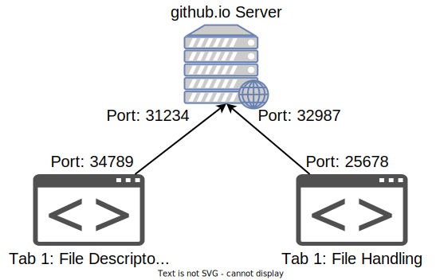

# Remote I/O

In the previous sections, we started looking into how applications interact with the outside world.
However, so far this "outside world" has only meant **local** files and other **local** processes.
But what about files located on other computers?
What about "talking to" processes running in other parts of the world?

## One Browser - Many Connections

What happens when we request a web page?
A simple example is <http://example.com/>.
When the browser displays this web page, it first **downloads** it and then **renders** it.
The web page comes as a file called `index.html`.
We can roughly redo its steps like this:

```console
student@os:~$ wget http://example.com/  # download index.html
wget http://example.com/
--2022-12-02 15:53:31--  http://example.com/
Resolving example.com (example.com)... 2606:2800:220:1:248:1893:25c8:1946, 93.184.216.34
Connecting to example.com (example.com)|2606:2800:220:1:248:1893:25c8:1946|:80... connected.
HTTP request sent, awaiting response... 200 OK
Length: 1256 (1,2K) [text/html]
Saving to: ‘index.html’

index.html                                                           100%[====================================================================================================================================================================>]   1,23K  --.-KB/s    in 0s

2022-12-02 15:53:31 (248 MB/s) - ‘index.html’ saved [1256/1256]
```

Then we can view the HTML contents of the file:

```html
student@os:~$ cat index.html
<!doctype html>
<html>
<head>
    <title>Example Domain</title>

    <meta charset="utf-8" />
    <meta http-equiv="Content-type" content="text/html; charset=utf-8" />
    <meta name="viewport" content="width=device-width, initial-scale=1" />
    <style type="text/css">
    body {
        background-color: #f0f0f2;
        margin: 0;
        padding: 0;
        font-family: -apple-system, system-ui, BlinkMacSystemFont, "Segoe UI", "Open Sans", "Helvetica Neue", Helvetica, Arial, sans-serif;

    }
    div {
        width: 600px;
        margin: 5em auto;
        padding: 2em;
        background-color: #fdfdff;
        border-radius: 0.5em;
        box-shadow: 2px 3px 7px 2px rgba(0,0,0,0.02);
    }
    a:link, a:visited {
        color: #38488f;
        text-decoration: none;
    }
    @media (max-width: 700px) {
        div {
            margin: 0 auto;
            width: auto;
        }
    }
    </style>
</head>

<body>
<div>
    <h1>Example Domain</h1>
    <p>This domain is for use in illustrative examples in documents. You may use this
    domain in literature without prior coordination or asking for permission.</p>
    <p><a href="https://www.iana.org/domains/example">More information...</a></p>
</div>
</body>
</html>
```

And, finally we can render the `index.html` file in the browser like so:

```console
student@os:~$ xdg-open index.html  # xdg-open invokes the OS's default program for opening HTML files
```

After running the command above, look at the URL in the browser.
It's not <http://example.com/> anymore, but the path to your **local** `index.html`.

So now you've switched from doing **remote** I/O back to **local** I/O.
Deluge does the same thing: it performs **remote** I/O operations to get files locally so that you, the user, can do **local** I/O with it.
Remote and local I/O are not by any means separated.
Rather, they are strongly intertwined.

## Connection

Focusing on how the `index.html` file is sent over the Web, we first need to establish the 2 **endpoints**.
We have a **sender**: the <http://example.com/> server.
Then we have a **receiver**: our host.
How do the 2 endpoints know each other?

### Recap: IPs

When someone asks you who you are on the internet, the answer is obvious: your **IP Address**.
IP Addresses are 32-bit (or 128-bit for IPv6) numbers that identify hosts on the web.
To find the IPv4 and IPv6 addresses of a host given by a URL, you can use the `host` command:

```console
student@os:~$ host example.com
example.com has address 93.184.216.34
example.com has IPv6 address 2606:2800:220:1:248:1893:25c8:1946
example.com mail is handled by 0 .
```

So we can imagine our browser identifies <http://example.com/> by its IP address, say `93.184.216.34`.
Similarly, the server also knows our host's IP address.
Each of them uses the other's IP address to locate their peer and communicate with them.

But what if we shift our example to another site: <https://open-education-hub.github.io/operating-systems/>?
Let's say we open 2 tabs:

- one to the [File Descriptors section](https://open-education-hub.github.io/operating-systems/Lab/I/O/File%20Descriptors/content/file-descriptors/) of this lab
- another one to the [File Handling section](https://open-education-hub.github.io/operating-systems/Lab/I/O/File%20Handlers/content/file-handlers/)

Now our browser needs to **know** what to with data coming from two sources.
In addition, the server also needs to maintain information about our 2 tabs so it can send the correct data to each of them.
Therefore, each tab establishes a different **connection** to the server.
All communication between the tab and the site occurs within this connection.

Now the question is: _how can we maintain 2 connections between 2 endpoints only identified by IPs?_
... and the answer is that we can't.
If the browser and the server were to only use IP addresses, they wouldn't be able to differentiate between the 2 connections mentioned above.
We need something more: **ports**

### Further than IPs: Ports

A port is simply a **number** assigned to uniquely identify a connection from a host to another and to direct the data that's transferred between them.
This way we can create multiple connections between the same 2 hosts.
Port numbers are encoded on 16 bits and thus range from $0$ to $2^{16} - 1$, i.e. from $0$ to $65535$.

The first 1024 ports are reserved for well-known system services, such as SSH (which uses port 22).
These services run using certain **communication protocols**.
A communication protocol is a set of rules that allow 2 or more hosts to communicate a certain way.
These rules include, but are not limited to:

- the format of each message: fields, sizes, maximum lengths etc.
- the order in which messages are sent
- the behaviour of the endpoints with respect to these messages

So the correct way of saying it isn't that the SSH process / service runs on port 22, but rather that **the SSH protocol runs on port 22**.

Our browser also uses ports to distinguish between different connections.
And so does the `github.io` server: it uses one port for sending the "File Descriptors" page and another for the "File Handling" page.
The image below shows how multiple tabs to the same site can be handled.
The prot numbers are chosen randomly.
They may have any value higher than 1023.



So it should be clear now that a connection is uniquely identified by **an IP and a port**.

### API - Hail Berkeley Sockets

Up to now we've described how sites work in general.
Before we can implement something of this sort ourserlves, we need to understand the API.
Unlike other APIs such as syscalls, which differ between OSs (Unix vs Windows for example), the one we're about to learn is almost universally adopted across OSs and programming languages.
It's called the [Berkeley Sockets API](https://en.wikipedia.org/wiki/Berkeley_sockets).
And with this, we've just introduced a new word: **socket**.


No, not this type of socket...
But our socket is somewhat similar _in concept_.
Just like wall sockets allow us to plug into the electric grid, network sockets allow us to "plug" into the Web.
Remember [file handlers](./file-handlers.md)?
You should.
File handlers are objects with which we can interact with files.
In a similar way, sockets are handlers for that provide an abstraction for a connection to another process, running either on a remote machine or on the same host.

#### Sender and Receiver

We'll start with 2 programs: a sender and a receiver.
Navigate to `support/send-receive/` and take a look at both `sender.py` and `receiver.py`.

The sender reads data from the keyboard and sends it to the receiver.
The receiver reads data continuously.
Upon receiving the message `"exit"`, it closes.
Otherwise, it prints whatever it receives to `stdout`.
This detail about how to handle a mesage containing `"exit"` may be regarded as a [communication protocol](#further-than-ips-ports) established between the sender and the receiver.

Now open 2 terminals (or use [tmux](https://tmuxcheatsheet.com/)).
First run `receiver.py` in one terminal.
Looking at its code, the receiver does 2 things.
It creates a socket:

```Python
sock = socket.socket(socket.AF_INET, socket.SOCK_DGRAM)
```

We'll explain at the arguments in the [next section](./networking-101.md#udp).
One thing to note here is that **sockets are file descriptors too**

The server displays its PID.
Give it as an argument to `lsof`, like you did in [the section on Redirections](./redirections.md), to visualise the file descriptors opened by `receiver.py`.

[Quiz 1](../quiz/receiver-socket-fd.md)

After creating the socket, the receiver exposes itself as "listening" for connections on IP `127.0.0.1` and on port 5000.
This means that it is now ready and waiting for other processes to send messages to it.

[Quiz 2](../quiz/bind-error-cause.md)

**Remember:**
**`bind()`-ing to a certain port locks (like a mutex) it for the current process.**
**No other socket may `bind()` to this port until the initial socket bound to it is `close()`d.**

Now run `sender.py` and type some messages.
See them appear in the terminal where `receiver.py` is running.
The sender creates a socket and then sends messages directly to IP `127.0.0.1` and port 5000 using `sendto()`.
Without stopping the first `sender.py` create another one in another terminal.
Type messages to both senders and see all of them displayed by `receiver.py` along with the addresses and ports from where they came.

In the end, both `sender.py` and `receiver.py` `close()` their sockets.
You can see this in analogy to regular file descriptors.

So we can use `sendto()` and `recvfrom()` to send and receive messages via sockets.
This is a very simple communication model where the receiver is like a "sink" that receives messages from anywhere.
As you can see, it has no control over who sends data to it.
To get a high-level understanding of how these messages are passed and what other models exist, head over to the [next section](./networking-101.md).

#### Practice: Network Sockets Challenge

Use the API you've just learned about to fill in the TODOs in `support/receive-challenges/receive_net_dgram_socket.c`.
This is like `receiver.py`
For it to run properly, you should compile it using `make`, then run it and after that run `send_net_dgram_socket`.
If you solved the challenge correctly, `receive_net_dgram_socket` should display the flag.
