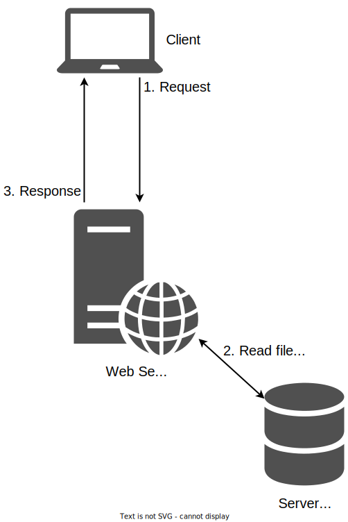
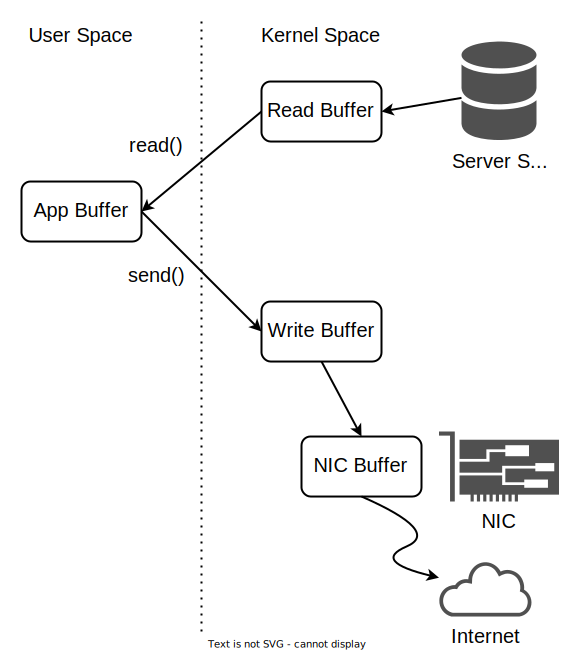

# Zero-Copy

Imagine a server that responds with files that it stores locally.
Its actions would be those highlighted in the image below:

1. Receive a new request and extract the filename
1. Read the filename from the disk into memory
1. Send the file from memory to the client



**The quiz below is tricky, yet very important.**
**Do NOT skip it in order for this section to make sense!**

[Quiz](../quiz/server-copies.md)

As you might have guessed, 2 of these copies are useless.
Since the app doesn't modify the file, there's no need for it to store the file in its own buffer.
It would be more efficient to use **a single** kernel buffer as intermediate storage between the disk and the NIC, as shown in the image below.


For an easier comparison with the "classic" `read()` + `send()` model, here's the first version again:



It should be obvious that the former approach is more efficient than the latter.
The syscall with which we can leverage **zero-copy** is called [`sendfile()`](https://man7.org/linux/man-pages/man2/sendfile.2.html).

## Practice: Measure It

So we have all the reasons to believe zero-copy is the faster of the two approaches we know.
But belief alone is meaningless.
Let's test it!

First, look at the code in `support/zero-copy/server.py`.
It spawns 2 threads.
One of them listens on port 8081 and serves connections via `read()` and `send()`.
The other listens on port 8082 and serves connections via `sendfile()`.
As you can see, the difference between them is minimal.

First generate the test file using the Makefile.
Then start the server in one terminal.
Now, in another one, use `benchmark_client.py` to benchmark both implementations.
Below are some generic results.
Yours might differ by quite a lot, as they depend on your disk, your NIC, your kernel, your Python version, the load on your system etc.

```console
student@os:/.../support/zero-copy$ python3 benchmark_client.py read-send
Time taken: 7.175773588009179 seconds

student@os:/.../support/zero-copy$ python3 benchmark_client.py sendfile
Time taken: 3.71454380400246 seconds
```

This is quite good!
Using `sendfile()` halves the number of copies needed from 4 to 2.
Thus, it makes sense for the running time to _roughly_ halve as well.

[Quiz](../quiz/fewer-than-2-copies.md)

You can read a slightly more detailed article about zero-copy [here](https://developer.ibm.com/articles/j-zerocopy/).
