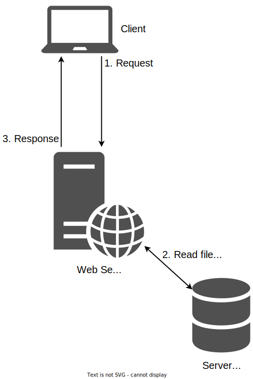

# Client-Server Number of Copies

## Question Text

The server in the image below uses regular TCP sockets to handle the connection and `send()` to send the data.
How many times are the contents of the file copied by the server while being sent to the client?

## Question Answers

- 2

- 1

+ 4

- 3

## Feedback

Rembember double buffering!
When the app calls `read()`, the server's kernel will first save the file to an internal buffer destined for reading.
Then the app will copy the file to its own buffer.
Following this step, the app will call `send()`, which will first copy the file to a buffer in the kernel.
From this buffer, the kernel itself will copy the file to another buffer on the NIC (Network Interface Card).
In total, there the file is copied **4 times**, as outlined in the image below.

