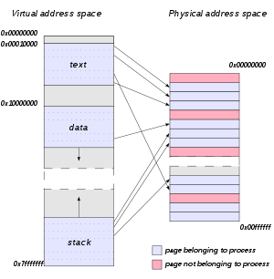

# Centered Text

Nice words

From presenter

Note: test note

---

# List Test

* About binary executables
* Sections

----

## Vertical Slide

Executable and Linking Format

Linux / Unix

----

## Split Slide (part 1)

readelf

nm

IDA

-----

## Split Slide (part 2)

strace

GDB

---

# Links

[OWASP Top 10](https://owasp.org/www-project-top-ten/)

----

<!-- .slide: data-auto-animate -->

## Animated

----

<!-- .slide: data-auto-animate -->

## Animated

recon

----

<!-- .slide: data-auto-animate -->

## Animated

recon

enumerate

----

<!-- .slide: data-auto-animate -->

## Animated

recon

enumerate

RCE

----

<!-- .slide: data-auto-animate -->

## Animated

recon

enumerate

RCE

PrivEsc

----

## Code

```python
import sys

def main():
    sys.exit(0)
```

----

## Text Color and Formatting
<!-- .element: style="color:yellow" -->

*red*
<!-- .element: style="color:red" -->

**blue**
<!-- .element: style="color:blue" -->

`green`
<!-- .element: style="color:green" -->

---

## Image


