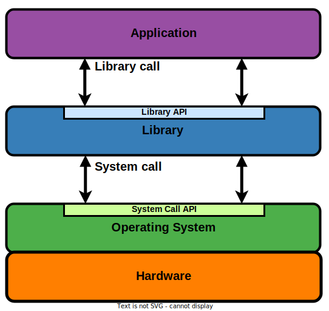

# Modern Software Stacks

Most modern computing systems use a software stack such as the one in the figure below:

This modern software stack allows fast development and provides a rich set of applications to the user.

The basic software component is the **operating system** (OS) (technically the operating system **kernel**).
The OS provides the fundamental primitives to interact with hardware (read and write data) and to manage the running of applications (such as memory allocation, thread creation, scheduling).
These primitives form the **system call API** or **system API**.
An item in the system call API, i.e. the equivalent of a function call that triggers the execution of a functionality in the operating system, is a **system call**.

The system call API is well-defined, stable and complete: it exposes the entire functionality of the operating system and hardware.
However, it is also minimalistic with respect to features, and it provides a low-level (close to hardware) specification, making it cumbersome to use and **not portable**.

Due to the downsides of the system call API, a basic library, the **standard C library** (also called **libc**), is built on top of it.
Because the system call API uses an OS-specific calling convention, the standard C library typically wraps each system call into an equivalent function call, following a portable calling convention.
More than these wrappers, the standard C library provides its own API that is typically portable.
Part of the API exposed by the standard C library is the **standard C API**, also called **ANSI C** or **ISO C**;
this API is typically portable across all platforms (operating systems and hardware).
This API, going beyond system call wrappers, has several advantages:

* portability: irrespective of the underlying operating system (and system call API), the API is the same
* extensive features: string management, I/O formatting
* possibility of increased efficiency with techniques such as buffering, as we show later
