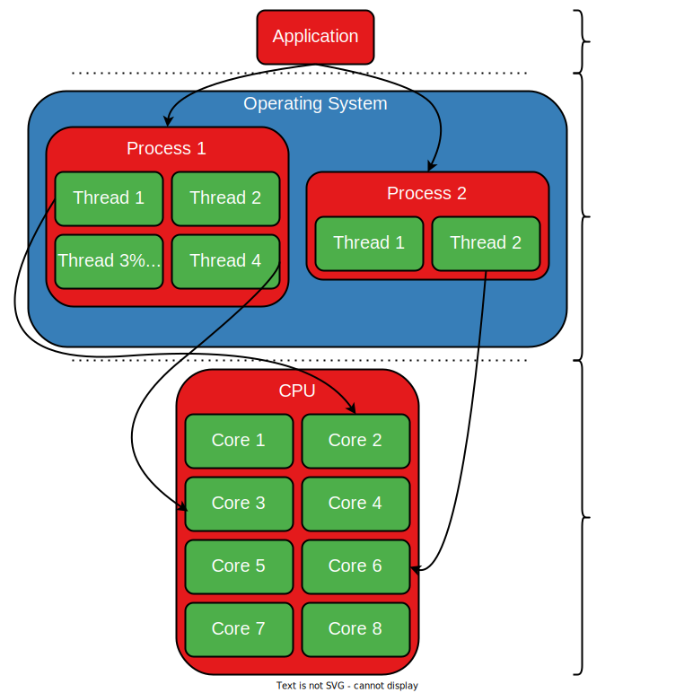

# Hardware Perspective

The main criterion we use to rank CPUs is their _computation power_, i.e. their ability to crunch numbers and do math.
Numerous benchmarks exist out there, and they are publicly displayed on sites such as [CPUBenchmark](https://www.cpubenchmark.net/).

For example, a benchmark can measure the performance of the computer's CPU in a variety of scenarios:

- its ability to perform integer operations
- its speed in floating point arithmetic
- data encryption and compression
- sorting algorithms and others

You can take a look at what exactly is measured using [this link](https://www.cpubenchmark.net/cpu.php?cpu=AMD+Ryzen+Threadripper+PRO+5995WX).
It displays the scores obtained by a high-end CPU.
Apart from the tests above, other benchmarks might focus on different performance metrics, such as branch prediction or prefetching.

Other approaches are less artificial, measuring performance on real-world applications such as compile times and performance in the latest (and most resource-demanding) video games.
The latter metric revolves around how many average FPS (frames per second) a given CPU is able to crank out in a specific video game.
[This article](https://www.gamersnexus.net/guides/3577-cpu-test-methodology-unveil-for-2020-compile-gaming-more) goes into more detail regarding the methodology of running CPU benchmarks on real-world applications.

Most benchmarks, unfortunately, are not open source, especially the more popular ones, such as [Geekbench 5](https://browser.geekbench.com/processor-benchmarks).
Despite this shortcoming, benchmarks are widely used to compare the performance of various computer **hardware**, CPUs included.

## The Role of the Operating System

As you've seen so far, the CPU provides the "muscle" required for fast computation, i.e. the highly optimised hardware and multiple ALUs, FPUs
and cores necessary to perform those computations.
However, it is the **operating system** that provides the "brains" for this computation.
Specifically, modern CPUs have the capacity to run multiple tasks in parallel.
But they do not provide a means to decide which task to run at each moment.
The OS comes as an _orchestrator_ to **schedule** the way these tasks (that we will later call threads) are allowed to run and use the CPU's resources.
This way, the OS tells the CPU what code to run on each CPU core so that it reaches a good balance between high throughput (running many instructions) and fair access to CPU cores.

It is cumbersome for a user-level application to interact directly with the CPU.
The developer would have to write hardware-specific code, which is not scalable and is difficult to maintain.
In addition, doing so would leave it up to the developer to isolate their application from the others that are present on the system.
This leaves applications vulnerable to countless bugs and exploits.

To guard apps from these pitfalls, the OS comes and mediates interactions between regular programs and the CPU by providing a set of **abstractions**.
These abstractions offer a safe, uniform and also isolated way to leverage the CPU's resources, i.e. its cores.
There are 2 main abstractions: **processes** and **threads**.

As we can see from the image above, an application can spawn one or more processes.
Each of these is handled and maintained by the OS.
Similarly, each process can spawn however many threads, which are also managed by the OS.
The OS decides when and on what CPU core to make each thread run.
This is in line with the general interaction between an application and the hardware: it is always mediated by the OS.
