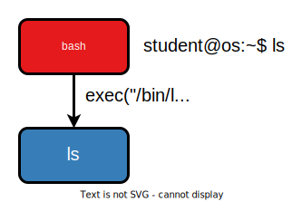

# `exec()` Without `fork()`

## Question Text

We type the following command:

```console
student@os:~$ ls
```

Why does the shell **NOT** simply call `exec("/bin/ls")`?



## Question Answers

- Because `/bin/ls` may be buggy or vulnerable and compromise the shell

+ Because when `ls` ends, the shell is closed

- Because the `ls` and `bash` processes must not share the same address space

- Because `bash` needs to pass data to the `ls` process

## Feedback

If the shell simply `exec`s `"/bin/ls"`, the `bash` process is entirely replaced by the `ls` process.
Therefore, when the `ls` process ends, the old `bash` process is no more and the terminal closes.
This way, each command would close the termianl.
