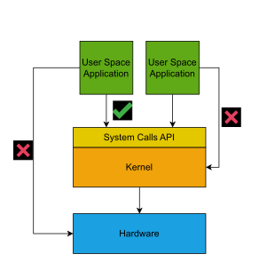

# Analyzing the Software Stack

To get a better grasp on how the software stack works, let's do a bottom-up approach:
we build and run different programs, that start off by using the system call API (the lowest layer in the software stack) and progressively use higher layers.

## System Calls Explained

A system call, or syscall for short, is a method used by applications to communicate with the operating system's kernel.

The need for syscalls is tied to the modern operating systems model of conceptually separating into kernel space and user space.

The kernel space manages the hardware resources such as CPU, I/O devices, disk or memory.
Moreover, the kernel also provides an interface for the user space applications to interact with the hardware.

The user space is where you are running your applications and processes.
From the user space, we cannot directly access the hardware or perform privileged operations.
You need to use syscalls to perform privileged operations such as accessing the hardware.

Below, you can see some examples of system calls and what resource they request from the kernel:

- `brk()` is used to allocate memory

- `open()` is used to access the file system and open a specific file

- `write()` is used to access the file system and modify the contents of a specific file



## Basic System Calls

The `support/basic-syscall/` folder stores the implementation of a simple program in assembly language for the x86_64 (64 bit) architecture.
The program invokes two system calls: `write` and `exit`.
The program is duplicated in two files using the two x86 assembly language syntaxes: the Intel / NASM syntax (`hello.asm`) and the AT&T / GAS syntax (`hello.s`).

The implementation follows the [x86_64 Linux calling convention](https://x64.syscall.sh/):

* system call ID is passed in the `rax` register
* system call arguments are passed, in order, in the `rdi`, `rsi`, `rdx`, `r10`, `r8`, `r9` registers

Let's build and run the two programs:

```console
student@os:~/.../lab/support/basic-syscall$ ls
hello.asm  hello.s  Makefile

student@os:~/.../lab/support/basic-syscall$ make
nasm -f elf64 -o hello-nasm.o hello.asm
cc -nostdlib -no-pie -Wl,--entry=main -Wl,--build-id=none  hello-nasm.o   -o hello-nasm
gcc -c -o hello-gas.o hello.s
cc -nostdlib -no-pie -Wl,--entry=main -Wl,--build-id=none  hello-gas.o   -o hello-gas

student@os:~/.../lab/support/basic-syscall$ ls
hello.asm  hello-gas  hello-gas.o  hello-nasm  hello-nasm.o  hello.s  Makefile

student@os:~/.../lab/support/basic-syscall$ ./hello-nasm
Hello, world!
student@os:~/.../lab/support/basic-syscall$ ./hello-gas
Hello, world!
```

The two programs end up printing the `Hello, world!` message at standard output by issuing the `write` system call.
Then they complete their work by issuing the `exit` system call.

The `write` system call writes a buffer to the file referred by the first argument, which is the file descriptor.
File descriptors are going to be studied in-depth in future chapters.
For now, it is enough for you to know that they are integers that behave like file handlers.
The 3 most common file descriptors are:

- `0` references the standard input (`stdin`)

- `1` references the standard output (`stdout`)

- `2` references the standard error (`stderr`)

Use `man 2 write` and `man 3 exit` to get a detailed understanding of the syntax and use of the two system calls.
You can also check the online man pages: [`write`](https://man7.org/linux/man-pages/man2/write.2.html), [`exit`](https://man7.org/linux/man-pages/man3/exit.3.html)

We use `strace` to inspect system calls issued by a program:

```console
student@os:~/.../lab/support/basic-syscall$ strace ./hello-nasm
execve("./hello-nasm", ["./hello-nasm"], 0x7ffc4e175f00 /* 63 vars */) = 0
write(1, "Hello, world!\n", 14Hello, world!
)         = 14
exit(0)                                 = ?
+++ exited with 0 +++
```

There are three system calls captured by `strace`:

* `execve`: this is issued by the shell to create the new process;
  you'll find out more about `execve` in the "Compute" chapter
* `write`: called by the program to print `Hello, world!` to standard output
* `exit`: to exit the program

This is the most basic program for doing system calls.
Given that system calls require a specific calling convention, their invocation can only be done in assembly language.
Obviously, this is not portable (specific to a given CPU architecture, x86_64 in our case) and too verbose and difficult to maintain.
For portability and maintainability, we require a higher level language, such as C.
In order to use C, we need function wrappers around system calls.

### Practice

Update the `hello.asm` and / or `hello.s` files to print both `Hello, world!` and `Bye, world!`.
This means adding another `write` system call.

[Quiz](../quiz/syscalls.md)
