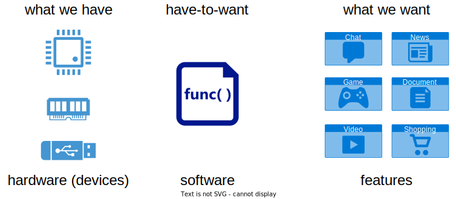
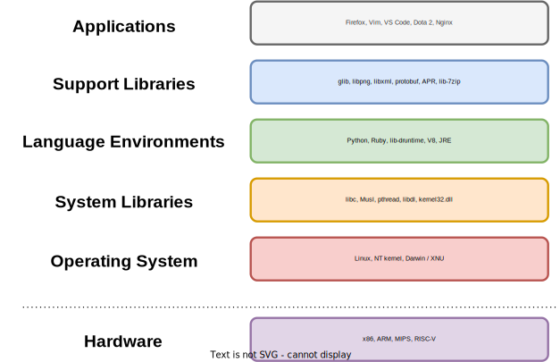

# Software Stack

Software comprises of code and data that is loaded in memory and used by the CPU.
Code means instructions that are to be fetched by the CPU, decoded and executed.
This is called **machine code**, i.e. binary instructions that are understood by the CPU.

So, when compared to hardware, **software is highly flexible**.
We can tie together specific instructions to handle a given task and run them on hardware (CPU, memory, I/O).
Different pieces of these instructions solve different tasks and run on the same hardware.
Moreover, these pieces of instructions can be duplicated and run on different pieces of hardware, thus providing **software reusability**.
All we are left with is creating those pieces of instructions, also called programs.

In summary, software has intrinsic characteristics:

* **flexibility**: We can (easily) create new pieces of software.
  Little is required, we don't need raw materials as in the case of hardware or housing or transportation.
* **reusability**: Software can be easily copied to new systems and provide the same benefits there.

Other characteristics are important to have, as they make life easier for both users and developers of software:

* **portability**: This is the ability to build and run the same program on different computing platforms.
  This allows a developer to write the application code once and then run it everywhere.
* **fast development**: We want developers to be able to write code faster, using higher-level programming languages.

The last two characteristics rely on two items:

* **higher-level programming languages**: As discussed above, a compiler will take a higher-level program and transform it into binary code for different computing platforms, thus providing portability.
  Also, it's easier to read (comprehend) and write (develop) source code in a higher-level programming language, thus providing fast development.
* **software stacks**: A software stack is the layering of software such that each lower layer provides a set of features that the higher layer can directly use.
  This means that there is no need for the higher layer to reimplement those features;
  this provides fast development: focus on only the newer / required parts of software.

  Also, each lower layer provides a generic interface to the higher layer.
  These generic interfaces "hides" possible differences in the even lower layers.
  This way, a software stack ensures portability across different other parts of software (and hardware as well).
  For example, the standard C library, that we will present shortly, ensures portability across different operating systems.

[Quiz](../quiz/software.md)

## Contents

- [Overview](overview.md)
- [Modern Software Stacks](modern-sw-stack.md)
- [Basic System Calls](basic-syscall.md)
- [System Call Wrapper](syscall-wrapper.md)
- [Common Functions](common-functions.md)
- [Libraries and libc](libc.md)
- [Statically-linked and Dynamically-linked Libraries](static-dynamic.md)
- [Library calls vs system calls](libcall-syscall.md)
- [High-Level Languages](high-level-lang.md)
- [App Investigation](app-investigate.md)
- [Arena](arena.md)
